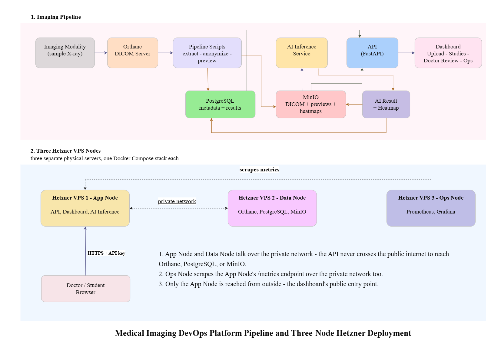

# Medical Imaging DevOps Platform

A small but realistic medical imaging system I built to practice connecting real engineering pieces into one working platform: imaging data, backend services, storage, AI, monitoring, and deployment.

This is a technical demo, not a clinical product. Every study it holds is sample data - nothing here is meant for real patients, and nothing here is a diagnosis.



## Demo video

[](https://youtu.be/5ZmylnoyiTs)

## What's inside

- **Orthanc** - the DICOM server (PACS). Receives and stores medical images.
- **PostgreSQL** - structured metadata: studies, AI results, audit events.
- **MinIO** - object storage for anonymized DICOM files, preview images, and AI heatmaps.
- **Pipeline scripts** (`services/metadata-extractor`, `services/anonymizer`, `services/preview-generator`, `services/minio-uploader`) - find a new study, anonymize it, generate a preview, and store both in MinIO.
- **AI inference** (`services/ai-inference`) - a real chest X-ray model (TorchXRayVision), returning findings, a confidence score, and a heatmap.
- **API** (`services/api`) - a FastAPI backend in front of all of the above, plus a browser dashboard.
- **Prometheus + Grafana** - metrics and dashboards for the API and the AI service.

It runs locally with Docker Compose, and it also runs deployed across three real Hetzner VPS servers - one for the application, one for data and imaging, one for monitoring. See `docs/deployment.md`.

## Running it locally

```bash
cp .env.example .env
docker compose up -d --build
```

| Service | URL |
|---|---|
| Dashboard | http://localhost:8000/dashboard/ |
| API docs (Swagger) | http://localhost:8000/docs |
| Orthanc | http://localhost:8042 |
| MinIO console | http://localhost:9001 |
| Prometheus | http://localhost:9090 |
| Grafana | http://localhost:3000 |

The dashboard asks for an API key the first time it's opened (see `API_SECRET_KEY` in `.env`).

## The dashboard

- **Home** - a visual walkthrough of the imaging pipeline, each step naming the real script behind it.
- **Studies** - every study in the system, its metadata, and its AI result if one exists.
- **Upload** - upload a sample X-ray as if it just came off a scanner.
- **Doctor Review** - the image, the AI's findings, and its heatmap; automatic AI review can be turned on or off.
- **Ops Dashboard** - direct links to every operational tool (Prometheus, Grafana, MinIO, Orthanc, API docs).

## The pipeline scripts

Each stage is a real, independently runnable script:

- `services/metadata-extractor/extract.py` - finds a new study, saves its metadata
- `services/anonymizer/anonymize.py` - strips identifying DICOM tags
- `services/preview-generator/generate_preview.py` - makes a viewable PNG
- `services/minio-uploader/upload.py` - stores the anonymized DICOM in MinIO
- `services/preview-generator/upload_preview.py` - stores the preview in MinIO

`docs/local-stack.md` covers running each one against a local stack.

## Tests and CI

```bash
pytest tests/
```

Every push runs the same checks through GitHub Actions (`.github/workflows/ci.yml`).

## Project record

This was built and documented one step at a time. `project-record/project-record.md` and `project-record/project-record-2.md` cover every step in order - what was added, why, how it was tested, and a screenshot backing it up.

Other docs:

- `docs/local-stack.md` - running every service and script locally.
- `docs/deployment.md` - deploying across three VPS nodes.
- `docs/ai-model-config.md` / `docs/ai-evaluation-notes.md` - the AI model and how it was evaluated.
- `docs/backup-restore.md`, `docs/security.md`, `docs/runbook.md` - operational docs.
- `docs/sample-data.md` - where the sample X-rays come from.
