# Project Record (continued)

This continues [project-record.md](project-record.md), which covers Steps 0 through 19 - the local stack, the pipeline, monitoring, and CI. This file picks up at Step 20, where the project moves from a local-only build to something actually pushed to GitHub and checked by real automation.

## Step 20 - GitHub Remote and Real CI Verification

In this step, the project was connected to its real GitHub repository for the first time, and the CI workflow from Step 19 was verified running for real instead of only locally.

```bash
git remote add origin https://github.com/SamParsakian/medimaging-devops-platform.git
git push -u origin main
```

Pushing `main` sent the full project history to GitHub and triggered the CI workflow automatically. It finished in 21 seconds, with every step passing on the very first real run.

A single passing run could just be luck, so the workflow was checked a second way too: by making a real change, opening a pull request, and watching CI react to it at every stage, the same way it would for any future change to this project.

Before touching anything, the local change waiting to be pushed was confirmed directly in the editor - the Step 20 entry being added to `project-record.md`:

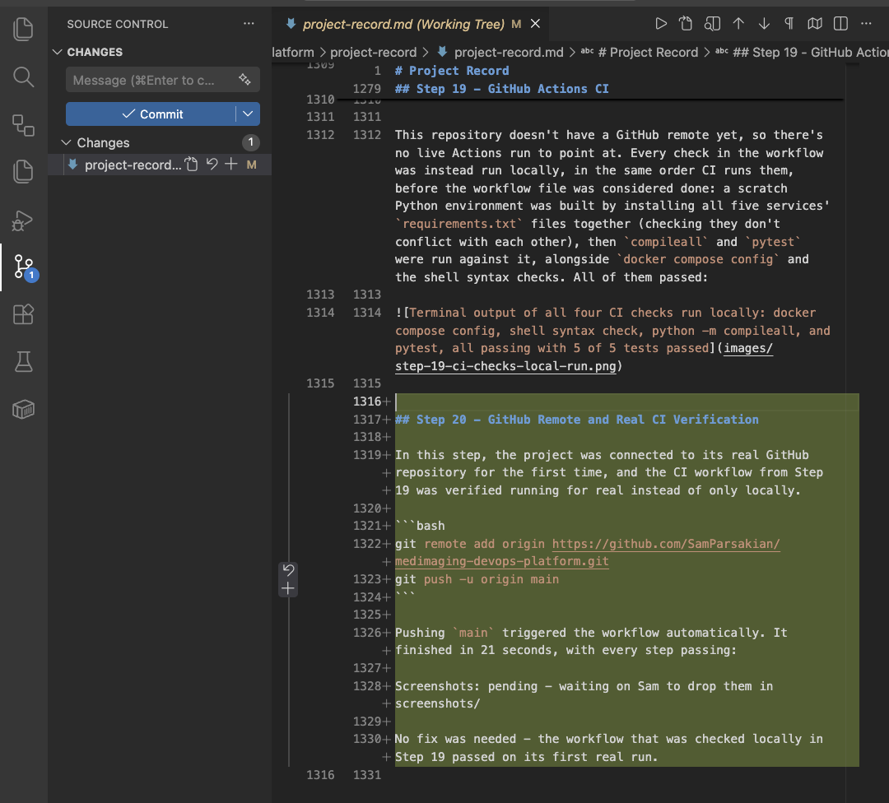

That change was committed and pushed on its own branch, not straight to `main`:

```bash
git add project-record/project-record.md
git commit -m "docs: record GitHub CI verification result"
git push -u origin feature/github-remote-ci-verification
```

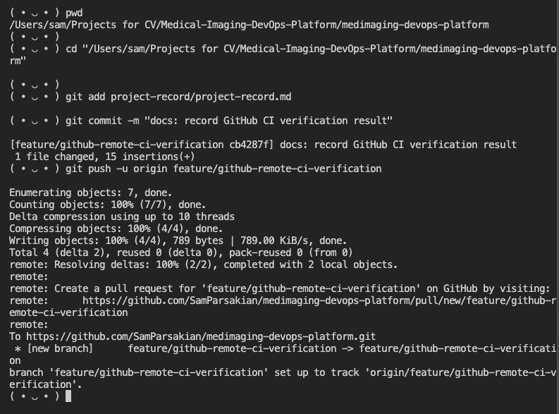

GitHub noticed the new branch immediately and offered to open a pull request for it:

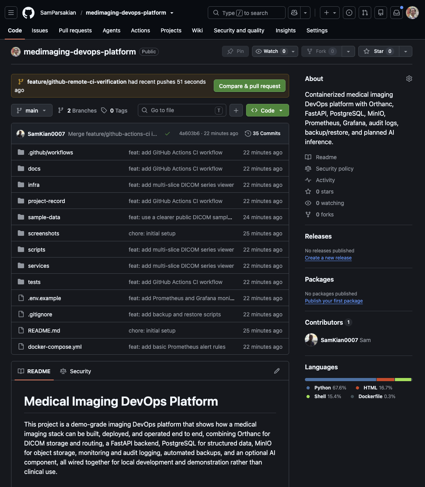

The pull request was opened with a short summary of the change, and GitHub's own diff view confirmed it was exactly the intended edit to `project-record.md` - nothing else:

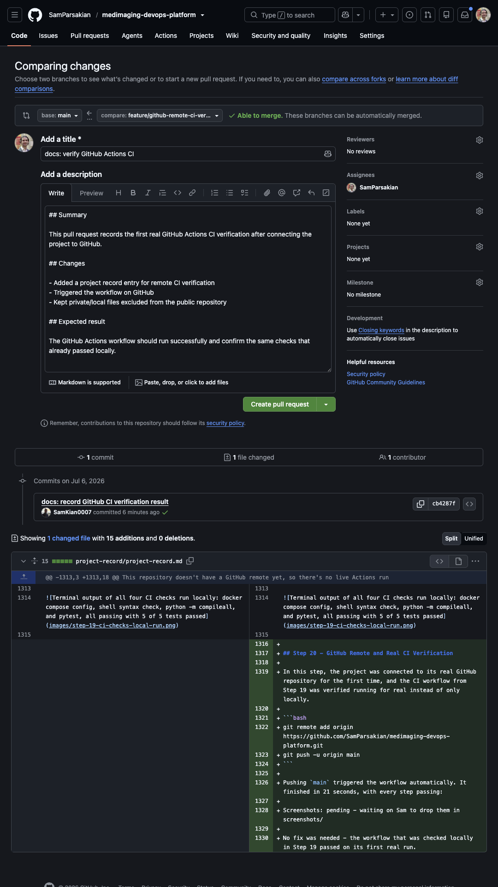

Before merging anything, the Actions history was checked as a baseline: two runs so far, both from the very first push of the whole project.

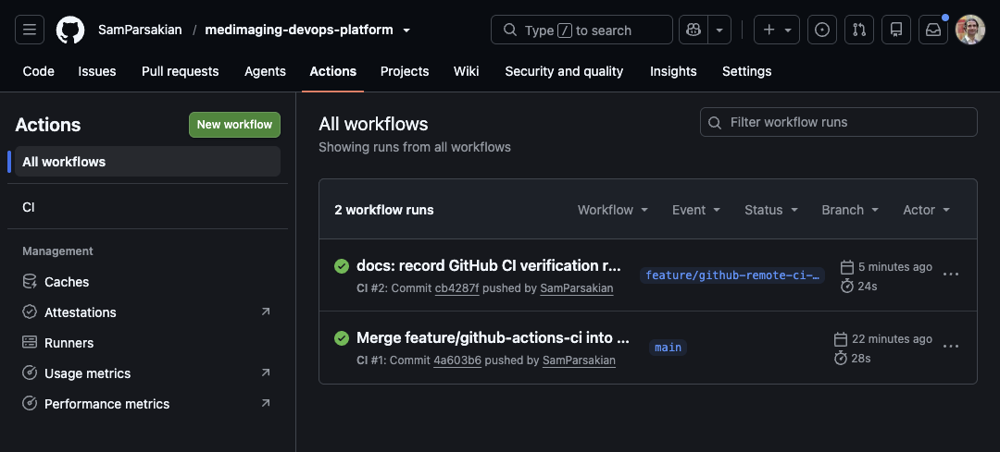

Opening the pull request triggered CI again on its own, this time as a pull-request check rather than a plain push. Once it finished, GitHub showed the pull request as ready to merge, with both of its checks green:

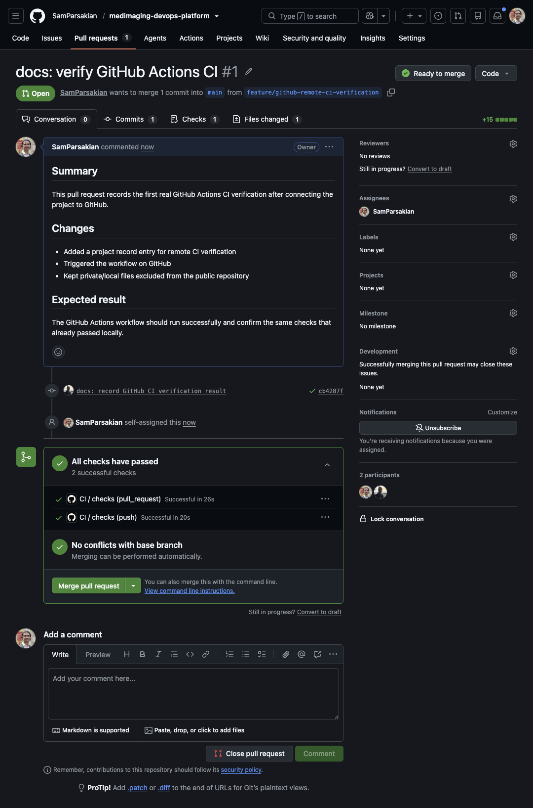

The pull request was merged from the GitHub UI, the same way any real pull request would be:

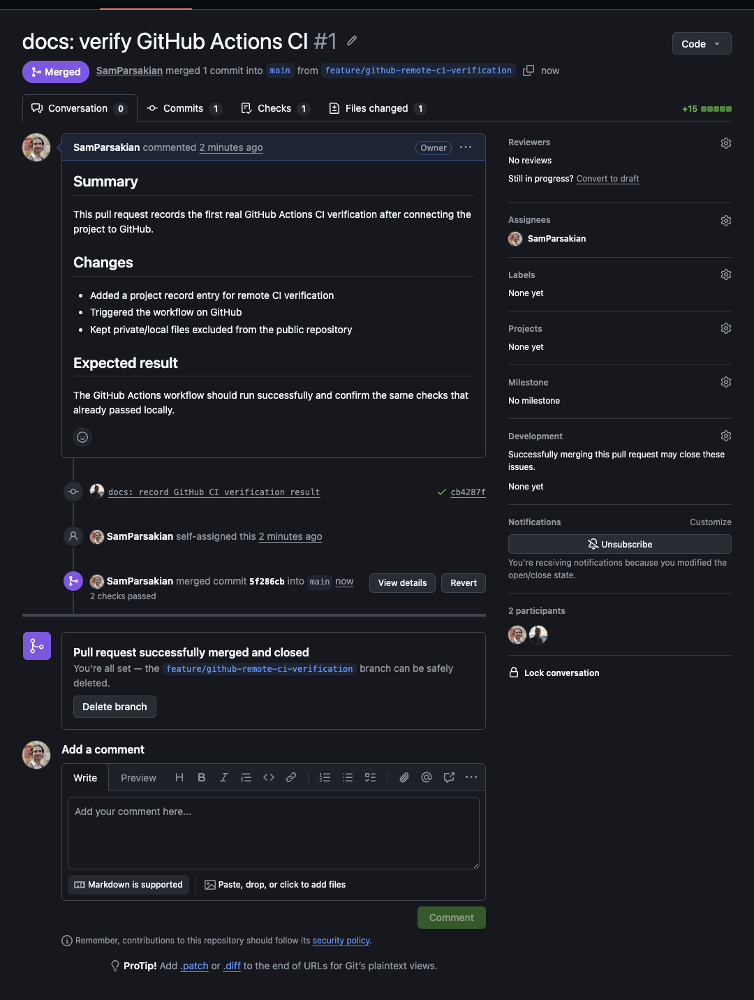

Merging into `main` triggered CI a third time. The Actions history now showed four runs in total instead of the two from before - the original push, the pull request's own check, and the merge into `main` - every single one green:

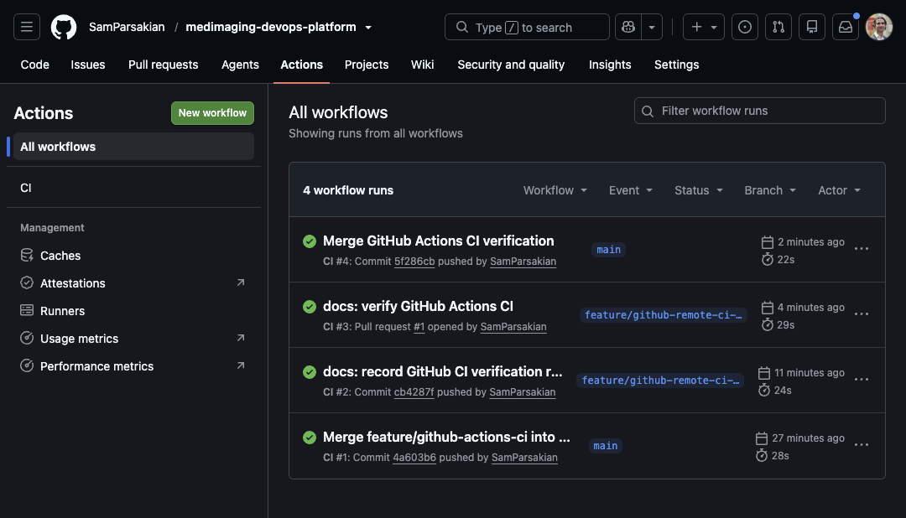

Opening that last run shows exactly what CI actually checks on every push: each step of the workflow from Step 19, in order, including the 5 unit tests passing:

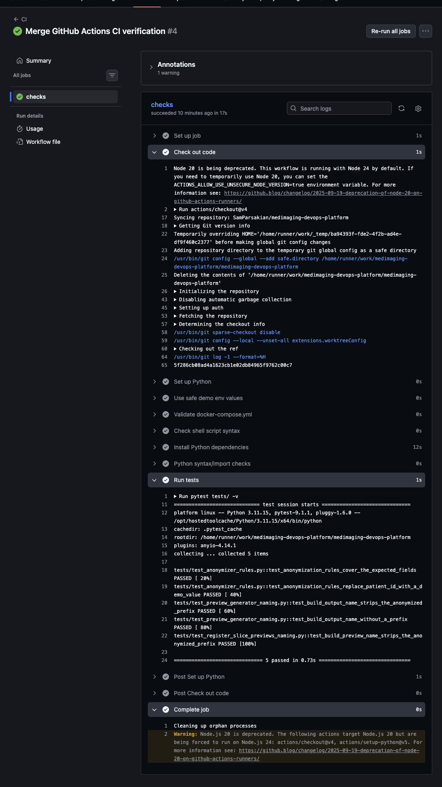

That screenshot is where this check ends: the same workflow from Step 19, holding up through a real push, a real pull request, and a real merge, without a single line of it needing to change.

## Step 21 - Local AI Inference Service

In this step, a new AI inference service was added: its own container, its own FastAPI app, that takes a study's preview image and returns an AI result as JSON.

This step focuses on the plumbing around an AI component - its own container, an input/output contract, and a dashboard hook - built first with a lightweight classifier based on pixel-intensity statistics, ahead of a trained model in a later step.

The new service lives in `services/ai-inference/`, containerized the same way every other service in this project is, and added to `docker-compose.yml` as its own entry:

```yaml
ai-inference:
  build:
    context: ./services/ai-inference
  container_name: ai-inference
  restart: unless-stopped
  ports:
    - "${AI_INFERENCE_PORT:-8100}:8100"
  environment:
    MINIO_HOST: minio
    MINIO_PORT: 9000
    MINIO_ROOT_USER: ${MINIO_ROOT_USER}
    MINIO_ROOT_PASSWORD: ${MINIO_ROOT_PASSWORD}
    MINIO_BUCKET: ${MINIO_BUCKET}
  depends_on:
    minio:
      condition: service_healthy
```

Docker Desktop shows it running as its own container, separate from the API, alongside everything else in the stack:

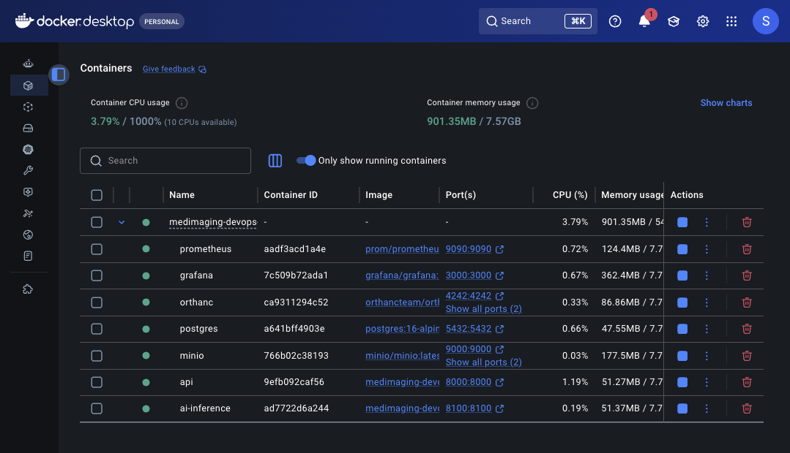

The classifier itself, `classify_pixels` in `services/ai-inference/main.py`, converts the image to grayscale and measures how much its pixel intensities vary relative to their average brightness. That single number gets bucketed into one of three labels:

```python
if variation >= HIGH_VARIATION_THRESHOLD:
    label = "high_variation_region"
elif variation <= LOW_VARIATION_THRESHOLD:
    label = "low_variation_region"
else:
    label = "moderate_variation_region"
```

Every result the service returns also carries a fixed disclaimer field, `"Technical demo only. Not for clinical diagnosis."`, alongside the label.

The service exposes two endpoints:

```text
GET  /health
POST /infer
```

`/health` was checked directly through the service's own Swagger page:

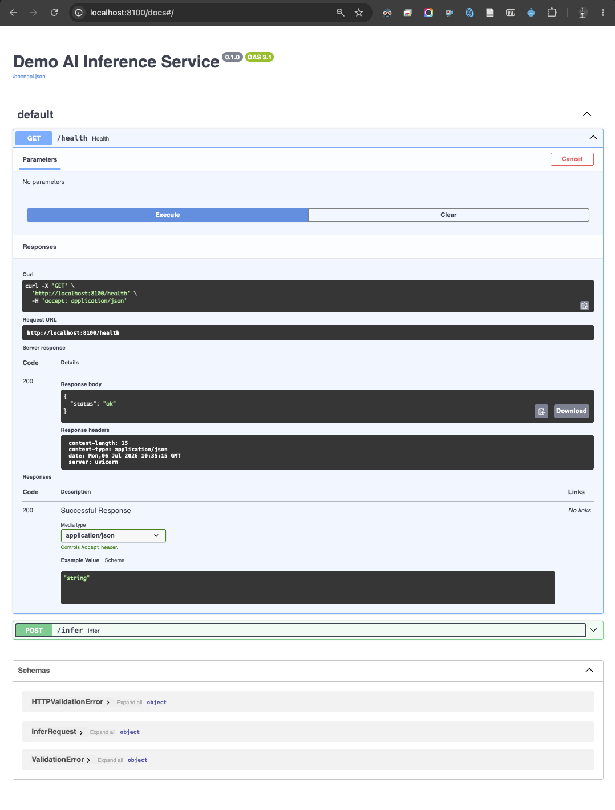

`/infer` takes the MinIO path of a preview image already produced by the existing pipeline (Step 6's preview generator) and returns the model name, version, the input path, the predicted label, a confidence score, how long the classification took, and the disclaimer:

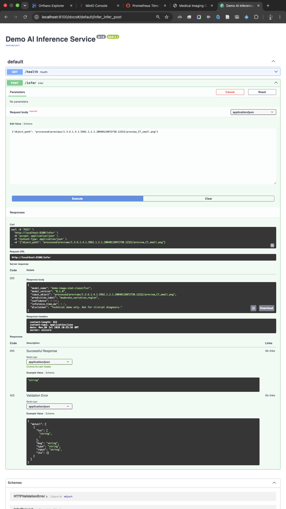

The existing `services/api` gained one new endpoint, `POST /studies/{id}/infer`, so a caller never has to know the ai-inference service or MinIO exist at all - it looks up the study's own preview path from Postgres and calls ai-inference on the caller's behalf, the same pattern the API already uses for streaming preview images:

```python
object_path = study["preview_object_path"]
ai_response = requests.post(
    f"http://{AI_INFERENCE_HOST}:{AI_INFERENCE_PORT}/infer",
    json={"object_path": object_path},
    timeout=10,
)
```

This endpoint sits behind the same API key middleware as every other endpoint in this project, so it was not given any auth logic of its own.

The dashboard's Study Detail panel got one new button, "Run AI Demo Inference," which calls that endpoint and shows the result inline. Clicking it on the MR series from Step 18 produced this result, and the audit trail underneath shows the `run_inference` event that click created:


The button always analyzes the study's one stored preview image, the same one shown before any slice is picked with Previous/Next - not whichever slice happens to be selected in the slider at the time.

Three small unit tests were added for `classify_pixels`, following the same pattern as every other pure-logic test in this project - no MinIO, no running containers, just the function itself against known pixel arrays:

```python
def test_classify_pixels_labels_a_uniform_image_as_low_variation():
    pixels = np.full((32, 32), 120, dtype=np.uint8)
    label, confidence = classify_pixels(pixels)
    assert label == "low_variation_region"
```

The service runs on CPU only, with no external AI API involved.

## Step 22 - Store AI Inference Results

In this step, every AI inference result started getting saved in PostgreSQL, instead of only existing for as long as the browser tab stayed open.

Step 21's "Run AI Demo Inference" button showed a real result the moment it ran, but reloading the page lost it - there was nowhere for it to live once the request finished. A new table holds one row per inference run:

```sql
CREATE TABLE IF NOT EXISTS ai_results (
    result_id SERIAL PRIMARY KEY,
    orthanc_study_id TEXT NOT NULL,
    input_object TEXT NOT NULL,
    model_name TEXT NOT NULL,
    model_version TEXT NOT NULL,
    prediction_label TEXT NOT NULL,
    confidence DOUBLE PRECISION NOT NULL,
    inference_time_ms DOUBLE PRECISION NOT NULL,
    disclaimer TEXT NOT NULL,
    created_at TIMESTAMPTZ NOT NULL DEFAULT now()
);
```

`POST /studies/{id}/infer` now inserts a row as soon as it gets a result back from the ai-inference service, right before returning that same result to the caller:

```python
result = ai_response.json()
store_ai_result(study_id, result)
log_audit_event(request, "run_inference", study_id, "success")
return result
```

Querying the table directly shows the row landing exactly as expected, matching what the endpoint returned:

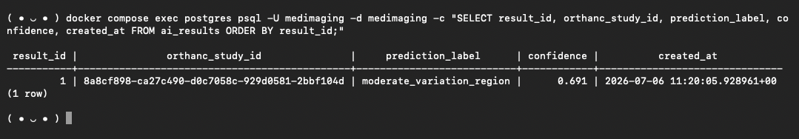

A new endpoint lists every result stored for a study, newest first:

```text
GET /studies/{id}/ai-results
```

Opening it directly in the browser returns the same fields Step 21 introduced, now with a `result_id` and `created_at` added:

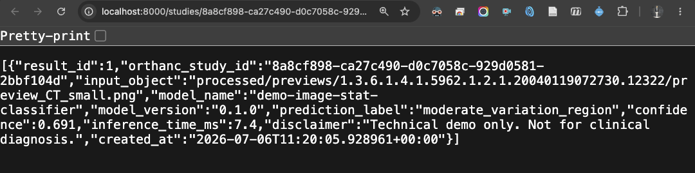

The dashboard's Study Detail panel now loads this list alongside the study, preview, and slice data it already fetched, and shows the newest entry in the same result box the "Run AI Demo Inference" button uses - so opening a study that already has a result shows it immediately, without clicking anything. A study with nothing stored yet shows a plain "No AI result yet for this study" message instead. Opening the MR series from Step 18, whose slice viewer is already in the same panel, shows its own stored result sitting right below it, disclaimer included:


Running inference on the same study again adds a second row rather than replacing the first, so a study's AI history builds up over time instead of only ever keeping the last run.

## Step 23 - AI Operations Polish

In this step, the ai-inference service gained the same kind of operational visibility the rest of the platform already has: metrics, a Prometheus target, a Grafana dashboard, and cleaner handling of bad input instead of an unhandled error.

A new `GET /metrics` endpoint on ai-inference (using `prometheus-client`, the same library the API already uses) exposes:

```text
ai_inference_requests_total    - counter, total requests received by /infer
ai_inference_failures_total    - counter, labeled by reason (not_found, invalid_image)
ai_inference_duration_seconds  - histogram of how long each /infer request took
ai_inference_model_info        - always 1, labeled with model_name and model_version
```

```bash
curl http://localhost:8100/metrics
```


Prometheus got a third scrape target alongside itself and the API:

```yaml
  - job_name: ai-inference
    metrics_path: /metrics
    static_configs:
      - targets: ["ai-inference:8100"]
```

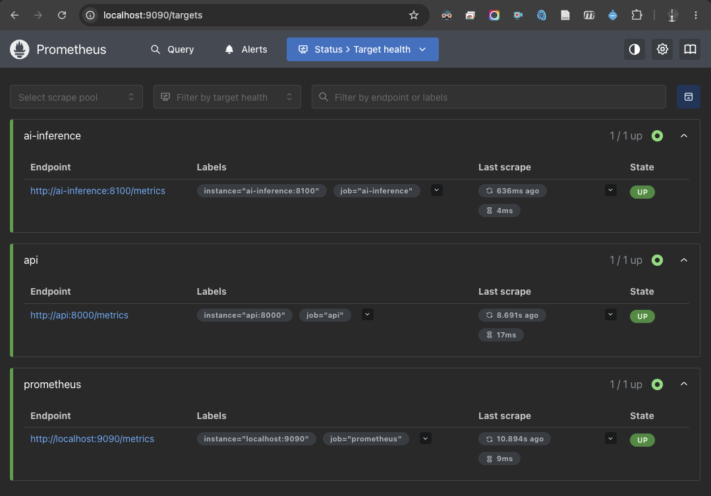

A second Grafana dashboard, "AI Inference Overview," is provisioned automatically the same way the existing one already is, with five panels: AI Service Up, Inference Requests, AI Failures, Average Inference Time, and a Model Info table showing the currently running `model_name`/`model_version`:

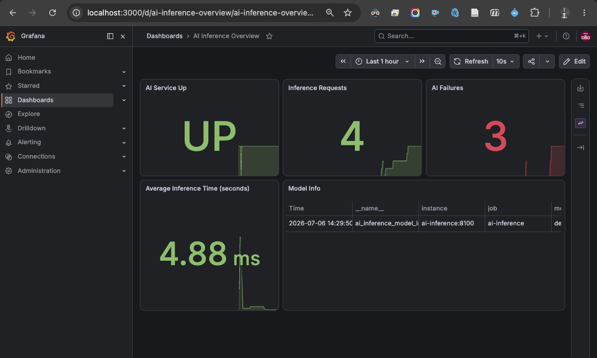

`/infer` also got stricter about what it accepts. An empty `object_path` is now rejected before the request is even handled:

```python
class InferRequest(BaseModel):
    object_path: str = Field(..., min_length=1)
```

And an object that exists in MinIO but isn't a valid image (a corrupt file, or the wrong kind of file entirely) now returns a clean 422 instead of crashing:

```python
try:
    image = Image.open(io.BytesIO(image_bytes)).convert("L")
    pixels = np.array(image)
except (UnidentifiedImageError, OSError) as exc:
    raise HTTPException(status_code=422, detail="Input object is not a valid image") from exc
```

Every one of these was tested directly against the running service:

```text
missing/non-existent object_path  -> 404 "Input object not found in MinIO"
object exists but isn't an image  -> 422 "Input object is not a valid image"
request body missing object_path -> 422 (field validation)
object_path is an empty string    -> 422 (field validation)
```

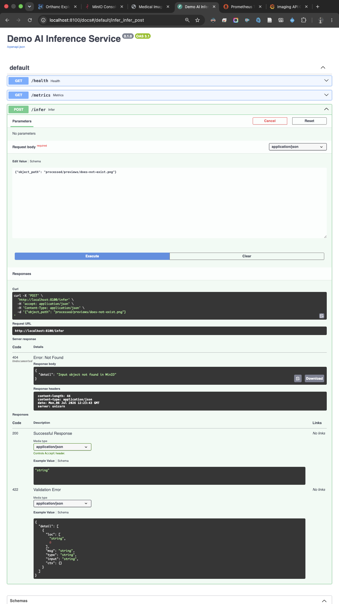

The API's proxy endpoint, `POST /studies/{id}/infer`, now forwards ai-inference's own status code and message when something goes wrong, rather than turning every failure into the same generic error:

```python
if ai_response.status_code != 200:
    detail = ai_response.json().get("detail", "AI inference service returned an error")
    raise HTTPException(status_code=ai_response.status_code, detail=detail)
```

A 502 is reserved for when ai-inference can't be reached at all - stopping the ai-inference container and calling the proxy endpoint returned a clean 502 with `"AI inference service unavailable"`, and starting it back up let a normal request through again right away.

The dashboard, the stored `ai_results` rows, and the disclaimer field all still work exactly as Step 21 and 22 left them:

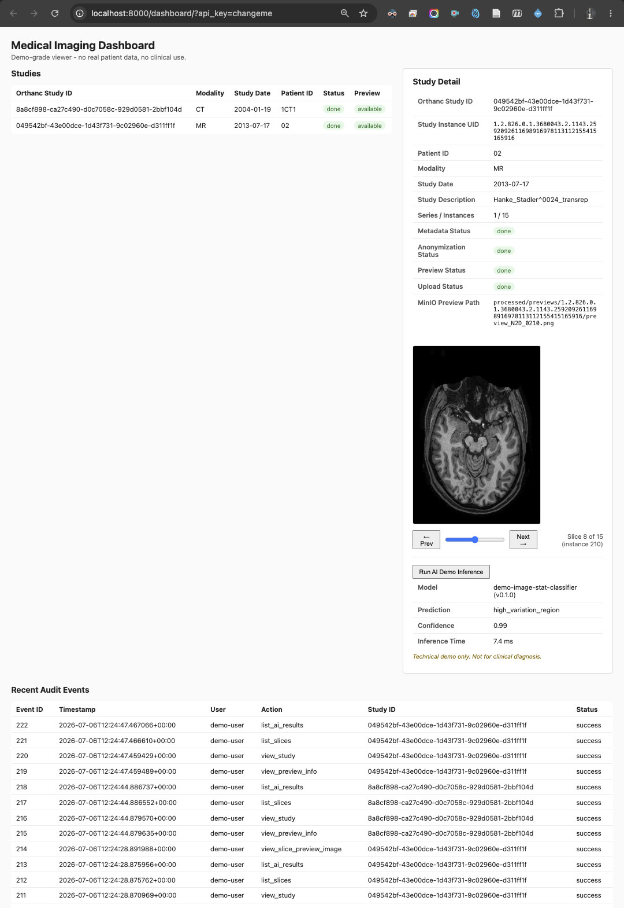

Three new pytest tests cover the `InferRequest` validation directly - a normal path is accepted, an empty string is rejected, and a missing field is rejected - no live service needed, following the same pure-logic testing pattern as every other test in this project.

## Step 24 - Real Chest X-ray AI Model

In this step, ai-inference's main path became a real pre-trained model instead of the pixel-statistics classifier from Step 21.

The old pixel-statistics classifier never looked at anatomy - it only measured how much the brightness varied across an image. This step replaces it with [TorchXRayVision](https://github.com/mlmed/torchxrayvision)'s `densenet121-res224-all`, a DenseNet trained specifically on chest X-rays. The model scores each image against 18 real chest findings:

```text
Atelectasis, Consolidation, Infiltration, Pneumothorax, Edema, Emphysema,
Fibrosis, Effusion, Pneumonia, Pleural_Thickening, Cardiomegaly, Nodule,
Mass, Hernia, Lung Lesion, Fracture, Lung Opacity, Enlarged Cardiomediastinum
```

Up to this point, settings like the model name, input size, and number of findings to show were just separate constants sitting inside `main.py`. That was fine with only a few of them, but harder to follow as more model-related values piled up.

This step moves all of them into one dedicated file, `services/ai-inference/model_config.py`. Anyone reading the project can now find the model's whole configuration in one place: which weights it uses and where they come from, how the input image gets prepared, how many findings to show, a documented confidence threshold, which hardware it runs on, and a rule the heatmap feature (built next, in Step 25) will follow. The exact values:

```text
Preprocessing:         grayscale -> normalize to [-1024, 1024] -> center-crop -> resize to 224x224
Top findings shown:    5
Confidence threshold:  0.5 (a finding scored at or above this is treated as a possible finding, not a diagnosis)
Runtime mode:          cpu
Heatmap target rule:   top_finding (used starting in Step 25)
```

The running service exposes all of this over HTTP:

```text
GET /config      - on ai-inference directly
GET /ai-config   - the same thing, proxied by the API
```

It also shows up on the dashboard, in a new "AI Model Configuration" panel at the top of the page:

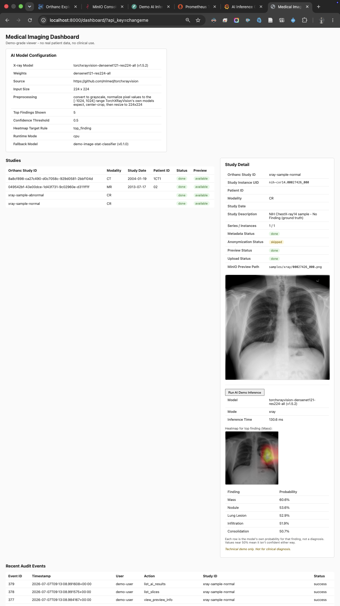

Two of these settings needed a more careful choice, so instead of just picking one and moving on, both were actually tested and compared - the full write-up is in `docs/ai-model-config.md`, summarized here.

The first choice was which pretrained weights to use. TorchXRayVision ships several, each trained on a different dataset, or combination of datasets. One of them, `nih`, is trained only on the NIH ChestX-ray14 dataset - the same dataset this project's own sample images come from, which makes it sound like the obvious match. The Cardiomegaly sample was run through both:

```text
weights="nih" (single-dataset, same source as the sample image)
  Cardiomegaly    0.6672
  Effusion        0.5665
  Mass            0.5322

weights="densenet121-res224-all" (multi-dataset, what this project uses)
  Cardiomegaly    0.6215
  Fibrosis        0.5402
  Infiltration    0.5220
```

Both versions agree on the top finding, Cardiomegaly, which is reassuring - but everything below it differs. A model trained on just one hospital's scans doesn't only learn the disease, it also partly learns that hospital's own scanner style, image quality, and patient population. Since this is a demo tool with no guarantee every future image will look like an NIH one, the multi-dataset `all` weights were chosen instead.

The second choice was image resolution. TorchXRayVision also offers a completely different model, `resnet50-res512-all`, that reads images at 512x512 pixels instead of 224x224. The larger input can keep more detail, but it also needs more computation. Timing one inference of each, on the same CPU, with nothing else different:

```text
224x224 DenseNet121 (chosen):  24.7 ms
512x512 ResNet50:              116.0 ms
```

The larger model was roughly 4.7x slower - a real cost on the CPU-only setup this project deliberately uses, so the smaller, faster architecture was kept.

The earlier classifier is kept as an automatic fallback:

```python
def run_inference(pixels, mode, object_path):
    if mode == "xray" and XRAY_MODEL is not None:
        try:
            return run_xray_inference(pixels)
        except Exception as exc:
            log_event("xray_fallback", status="fallback", level="WARNING", error=str(exc))
    return run_stat_inference(pixels)
```

The logic is simple: try the real X-ray model first if `mode` is `"xray"`. If that fails for any reason, log it and fall back to the older statistical result instead. This keeps the service answering requests even when the full model isn't available.

The model needs an actual chest X-ray to say anything meaningful, so two public samples from the NIH ChestX-ray14 dataset were added (see `docs/sample-data.md` for the full source and license) - one the dataset's own ground truth labels as `Cardiomegaly`, the other as `No Finding`:

```text
00000001_000.png  - NIH ground-truth label: Cardiomegaly (abnormal)
00027426_000.png  - NIH ground-truth label: No Finding (normal)
```

Both are already plain PNGs, not DICOM files. Because of that, they don't need the anonymizer or preview-generator step. A new script uploads each straight to MinIO and registers it as its own study, reusing the existing `studies` table and dashboard exactly as-is:

```bash
./scripts/download-xray-samples.sh
./services/metadata-extractor/.venv/bin/python services/metadata-extractor/register_xray_samples.py
```

Running the model against the "No Finding" sample produced something worth explaining rather than hiding. Its top probabilities - Mass 60.6%, Nodule 53.6%, and a few others in the same range - could look like confident detections at a glance. They aren't. This model scores every finding independently on a 0-1 scale, and values near 0.5 mean the model is genuinely unsure, not that it spotted something. The dashboard now says so directly, underneath the findings table:


Calling `/infer` directly returns every finding's probability, not just the top ones:

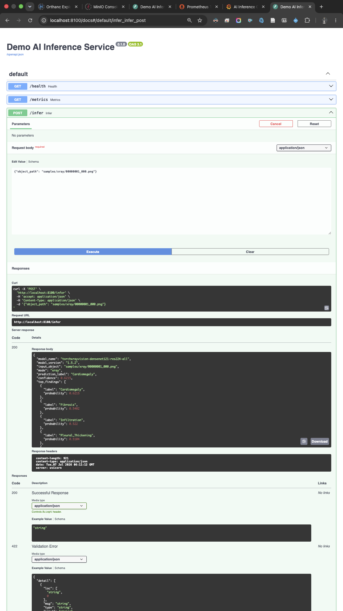

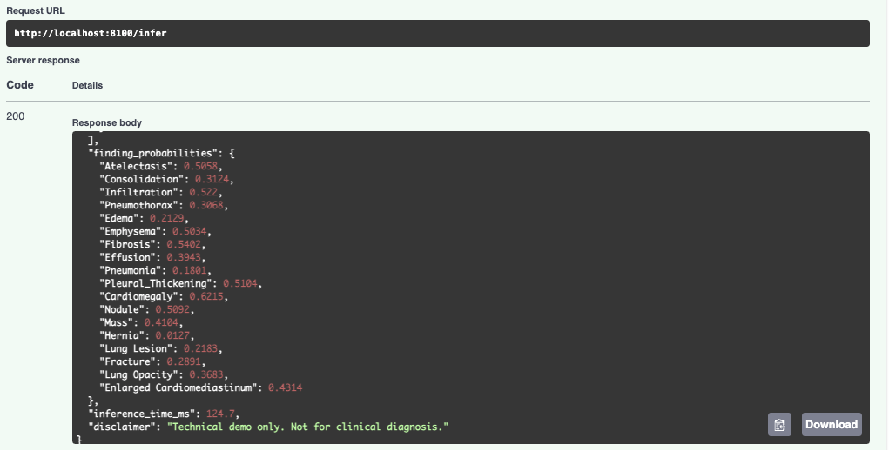

`ai_results` gained two new columns to hold this:

```sql
ALTER TABLE ai_results ADD COLUMN mode TEXT;
ALTER TABLE ai_results ADD COLUMN findings JSONB;
```

`mode` stores which model actually ran. `findings` stores the top labeled probabilities as JSON. Querying a stored result directly confirms both land correctly, matching what the endpoint returned:

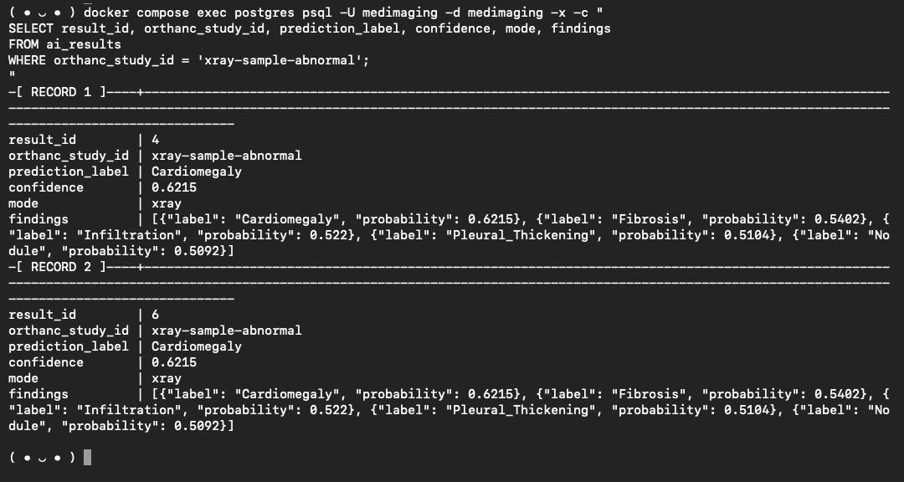

Adding a real machine learning library also has a visible cost. The ai-inference container is now much bigger than every other service in this project - torch, torchvision, and TorchXRayVision together bring it to around 1.9 GB, against tens of MB for the rest. The model's weights are downloaded once at Docker build time rather than when the container starts, so running the stack afterward never depends on internet access.

Four new pytest tests cover the stat/X-ray dispatch logic directly: `run_stat_inference`'s output shape, and `run_inference` falling back correctly when the X-ray model isn't loaded. That's always true for a plain import, since model loading only happens through the app's real startup, never at import time - so these tests need no torch model and stay fast.

Two real snags came up while wiring the model into the service, worth knowing about since they're the kind of thing anyone integrating a newer library version can run into:

- FastAPI removed its older way of running startup code in the version this project uses - `app.on_event("startup")` and the underlying `add_event_handler` method are both gone. The fix was switching to FastAPI's current approach instead: a `lifespan` function that runs `load_xray_model()` once when the app actually starts, not when the file is merely imported.
- A logging call accidentally passed the same argument twice - once by position, once by name. Python treats that as an error rather than picking one, so removing the duplicate fixed it.

Neither changed how the finished feature behaves - both were caught and fixed before this step was verified end to end.

The same library also slowed down CI. The GitHub Actions check that runs on every push used to finish in about 30 seconds. It now takes about a minute and a half, since it has to install PyTorch and TorchXRayVision every time. Still fast enough not to be a problem, just worth knowing why it grew.

## Step 25 - X-ray AI Heatmap Overlay

In this step, every X-ray inference result started coming with a heatmap image alongside it.

A probability number alone doesn't answer an obvious question: which part of the image actually made the model say that? A heatmap answers it directly, by lighting up the exact area the model weighted most heavily for one specific finding - which finding is controlled by `model_config.py`'s `heatmap_target_rule`, set to `top_finding`. In practice that means the heatmap is always built for whichever finding scored highest, not a fixed or manually chosen one - a different config value later could point it at a different finding without any code change here.

There are two well-known ways to build this kind of heatmap for a CNN (a convolutional neural network - the type of model used here, which scans an image in small overlapping patches rather than all at once). The newer, more general technique is called Grad-CAM. There's also an older, simpler technique it grew out of, called plain CAM (Class Activation Mapping). CAM only works if a network's last few layers are built a specific way - and TorchXRayVision's DenseNet happens to be built exactly that way.

Its last step takes everything the network learned about the image, averages it down into one compact set of numbers, and feeds that straight into a single scoring layer with nothing else in between. Because of that specific shape, plain CAM gives the exact same answer Grad-CAM would - just more directly, without Grad-CAM's extra step of running the network backward to work out which pixels mattered. That's why this project uses CAM:

```python
def compute_cam(feature_maps, class_weights):
    cam = np.tensordot(class_weights, feature_maps, axes=([0], [0]))
    cam = np.maximum(cam, 0)
    if cam.max() > 0:
        cam = cam / cam.max()
    return cam
```

`feature_maps` comes from a forward hook - a small piece of code that reads a layer's output as data passes through the model, without changing how the model runs - placed on the model's last convolutional layer. `class_weights` is simply the row of the classifier's weight matrix for the top finding.

The result is a small 7x7 grid, one value per patch of the image rather than per pixel. That grid is resized up to the model's 224x224 input size and blended over the original image with a small hand-written colormap (black to red to yellow to white) - no extra plotting library needed for that.

The heatmap PNG is uploaded to MinIO under a new `heatmaps/` prefix, and its path is linked to the row through a new column:

```sql
ALTER TABLE ai_results ADD COLUMN heatmap_object TEXT;
```

A new endpoint streams it, the same MinIO-streaming pattern every other image endpoint in this API already uses:

```text
GET /studies/{id}/ai-results/{result_id}/heatmap-image
```

The dashboard's Study Detail panel shows the heatmap right under the model/mode/inference-time table, above the findings table - so the original X-ray, the AI's own findings, and where it was looking all sit in the same place. Running it on the Cardiomegaly sample, the heatmap lines up right over the heart:


The same thing on the "No Finding" sample, whose top finding was `Mass`, shows the heatmap sitting over a different part of the lung field entirely - proof the heatmap moves with whatever the model actually flagged, not a fixed spot on the image:

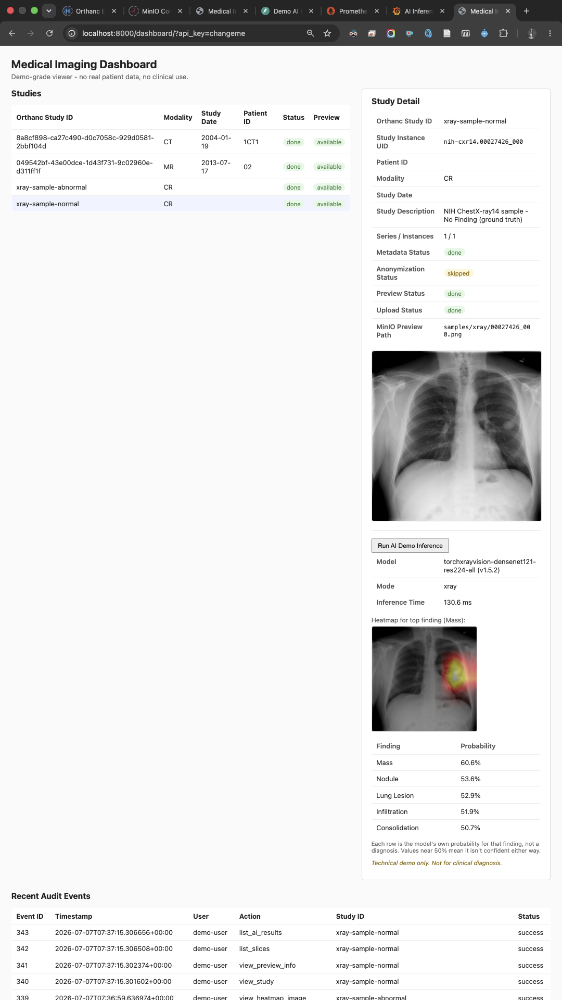

Querying the stored row directly shows the same path the dashboard used:

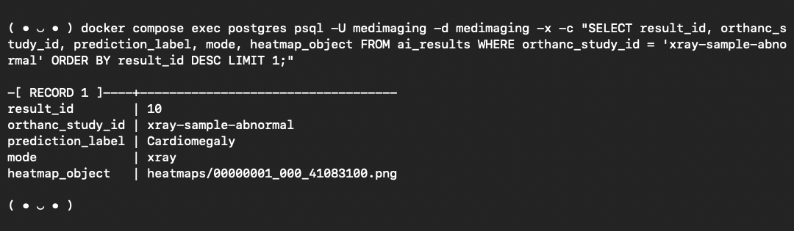

And the file the database points at is a real object sitting in MinIO, not just a path string - the bucket now has a `heatmaps/` folder alongside `processed/` and `samples/`:

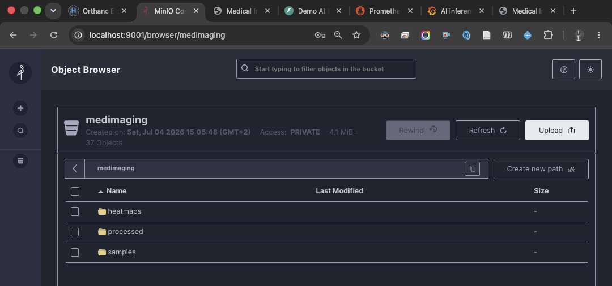

Opening one of the files inside confirms it's a real, viewable image - the same heatmap PNG shown in the dashboard:

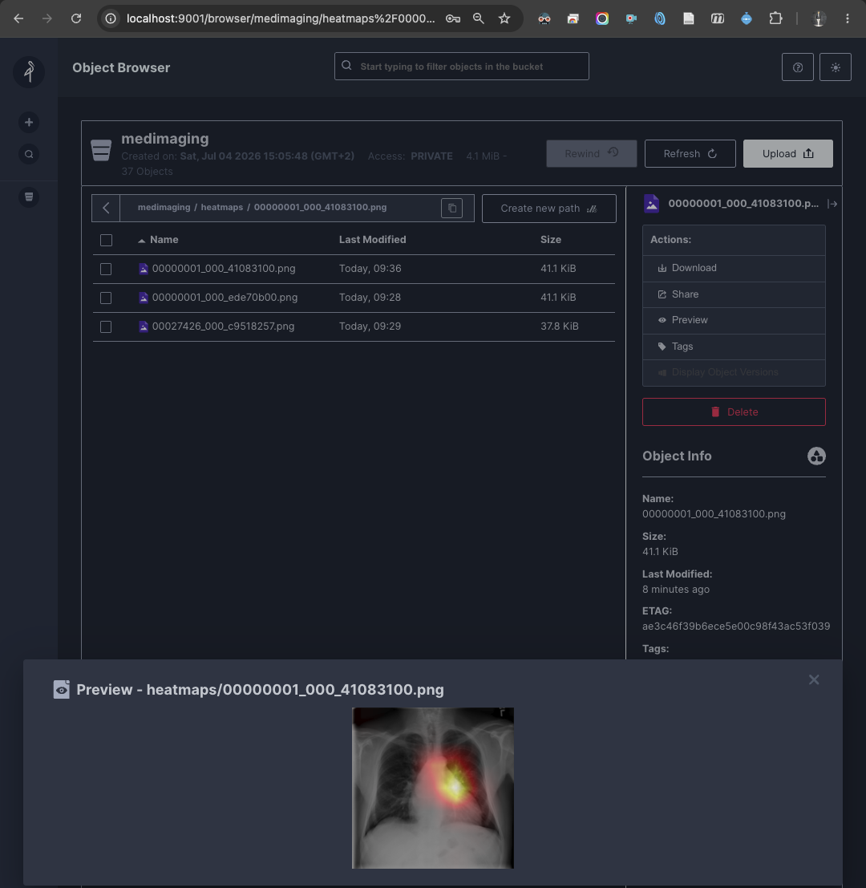

`POST /studies/{id}/infer` now returns the new row's `result_id` directly in its own response (`store_ai_result` uses `RETURNING result_id`). That's what lets the dashboard build a heatmap URL immediately after a fresh run, not only for a result it loads later.

Four new pytest tests cover `compute_cam`, `apply_colormap`, and `build_heatmap_overlay` directly against small synthetic arrays - pure math and image blending, no torch model needed for any of it.
