# Project Record (continued)

This continues [project-record.md](project-record.md), which covers Steps 0 through 19 - the local stack, the pipeline, monitoring, and CI. This file picks up at Step 20, where the project moves from a local-only build to something actually pushed to GitHub and checked by real automation.

## Step 20 - GitHub Remote and Real CI Verification

In this step, the project was connected to its real GitHub repository for the first time, and the CI workflow from Step 19 was verified running for real instead of only locally.

```bash
git remote add origin https://github.com/SamParsakian/medimaging-devops-platform.git
git push -u origin main
```

Pushing `main` sent the full project history to GitHub and triggered the CI workflow automatically. It finished in 21 seconds, with every step passing on the very first real run.

A single passing run could just be luck, so the workflow was checked a second way too: by making a real change, opening a pull request, and watching CI react to it at every stage, the same way it would for any future change to this project.

Before touching anything, the local change waiting to be pushed was confirmed directly in the editor - the Step 20 entry being added to `project-record.md`:


That change was committed and pushed on its own branch, not straight to `main`:

```bash
git add project-record/project-record.md
git commit -m "docs: record GitHub CI verification result"
git push -u origin feature/github-remote-ci-verification
```


GitHub noticed the new branch immediately and offered to open a pull request for it:


The pull request was opened with a short summary of the change, and GitHub's own diff view confirmed it was exactly the intended edit to `project-record.md` - nothing else:


Before merging anything, the Actions history was checked as a baseline: two runs so far, both from the very first push of the whole project.


Opening the pull request triggered CI again on its own, this time as a pull-request check rather than a plain push. Once it finished, GitHub showed the pull request as ready to merge, with both of its checks green:


The pull request was merged from the GitHub UI, the same way any real pull request would be:


Merging into `main` triggered CI a third time. The Actions history now showed four runs in total instead of the two from before - the original push, the pull request's own check, and the merge into `main` - every single one green:


Opening that last run shows exactly what CI actually checks on every push: each step of the workflow from Step 19, in order, including the 5 unit tests passing:


That screenshot is where this check ends: the same workflow from Step 19, holding up through a real push, a real pull request, and a real merge, without a single line of it needing to change.

## Step 21 - Local AI Inference Service

In this step, a new AI inference service was added: its own container, its own FastAPI app, that takes a study's preview image and returns an AI result as JSON.

This step focuses on the plumbing around an AI component - its own container, an input/output contract, and a dashboard hook - built first with a lightweight classifier based on pixel-intensity statistics, ahead of a trained model in a later step.

The new service lives in `services/ai-inference/`, containerized the same way every other service in this project is, and added to `docker-compose.yml` as its own entry:

```yaml
ai-inference:
  build:
    context: ./services/ai-inference
  container_name: ai-inference
  restart: unless-stopped
  ports:
    - "${AI_INFERENCE_PORT:-8100}:8100"
  environment:
    MINIO_HOST: minio
    MINIO_PORT: 9000
    MINIO_ROOT_USER: ${MINIO_ROOT_USER}
    MINIO_ROOT_PASSWORD: ${MINIO_ROOT_PASSWORD}
    MINIO_BUCKET: ${MINIO_BUCKET}
  depends_on:
    minio:
      condition: service_healthy
```

Docker Desktop shows it running as its own container, separate from the API, alongside everything else in the stack:


The classifier itself, `classify_pixels` in `services/ai-inference/main.py`, converts the image to grayscale and measures how much its pixel intensities vary relative to their average brightness. That single number gets bucketed into one of three labels:

```python
if variation >= HIGH_VARIATION_THRESHOLD:
    label = "high_variation_region"
elif variation <= LOW_VARIATION_THRESHOLD:
    label = "low_variation_region"
else:
    label = "moderate_variation_region"
```

Every result the service returns also carries a fixed disclaimer field, `"Technical demo only. Not for clinical diagnosis."`, alongside the label.

The service exposes two endpoints:

```text
GET  /health
POST /infer
```

`/health` was checked directly through the service's own Swagger page:


`/infer` takes the MinIO path of a preview image already produced by the existing pipeline (Step 6's preview generator) and returns the model name, version, the input path, the predicted label, a confidence score, how long the classification took, and the disclaimer:


The existing `services/api` gained one new endpoint, `POST /studies/{id}/infer`, so a caller never has to know the ai-inference service or MinIO exist at all - it looks up the study's own preview path from Postgres and calls ai-inference on the caller's behalf, the same pattern the API already uses for streaming preview images:

```python
object_path = study["preview_object_path"]
ai_response = requests.post(
    f"http://{AI_INFERENCE_HOST}:{AI_INFERENCE_PORT}/infer",
    json={"object_path": object_path},
    timeout=10,
)
```

This endpoint sits behind the same API key middleware as every other endpoint in this project, so it was not given any auth logic of its own.

The dashboard's Study Detail panel got one new button, "Run AI Demo Inference," which calls that endpoint and shows the result inline. Clicking it on the MR series from Step 18 produced this result, and the audit trail underneath shows the `run_inference` event that click created:


The button always analyzes the study's one stored preview image, the same one shown before any slice is picked with Previous/Next - not whichever slice happens to be selected in the slider at the time.

Three small unit tests were added for `classify_pixels`, following the same pattern as every other pure-logic test in this project - no MinIO, no running containers, just the function itself against known pixel arrays:

```python
def test_classify_pixels_labels_a_uniform_image_as_low_variation():
    pixels = np.full((32, 32), 120, dtype=np.uint8)
    label, confidence = classify_pixels(pixels)
    assert label == "low_variation_region"
```

The service runs on CPU only, with no external AI API involved.

## Step 22 - Store AI Inference Results

In this step, every AI inference result started getting saved in PostgreSQL, instead of only existing for as long as the browser tab stayed open.

Step 21's "Run AI Demo Inference" button showed a real result the moment it ran, but reloading the page lost it - there was nowhere for it to live once the request finished. A new table holds one row per inference run:

```sql
CREATE TABLE IF NOT EXISTS ai_results (
    result_id SERIAL PRIMARY KEY,
    orthanc_study_id TEXT NOT NULL,
    input_object TEXT NOT NULL,
    model_name TEXT NOT NULL,
    model_version TEXT NOT NULL,
    prediction_label TEXT NOT NULL,
    confidence DOUBLE PRECISION NOT NULL,
    inference_time_ms DOUBLE PRECISION NOT NULL,
    disclaimer TEXT NOT NULL,
    created_at TIMESTAMPTZ NOT NULL DEFAULT now()
);
```

`POST /studies/{id}/infer` now inserts a row as soon as it gets a result back from the ai-inference service, right before returning that same result to the caller:

```python
result = ai_response.json()
store_ai_result(study_id, result)
log_audit_event(request, "run_inference", study_id, "success")
return result
```

Querying the table directly shows the row landing exactly as expected, matching what the endpoint returned:


A new endpoint lists every result stored for a study, newest first:

```text
GET /studies/{id}/ai-results
```

Opening it directly in the browser returns the same fields Step 21 introduced, now with a `result_id` and `created_at` added:


The dashboard's Study Detail panel now loads this list alongside the study, preview, and slice data it already fetched, and shows the newest entry in the same result box the "Run AI Demo Inference" button uses - so opening a study that already has a result shows it immediately, without clicking anything. A study with nothing stored yet shows a plain "No AI result yet for this study" message instead. Opening the MR series from Step 18, whose slice viewer is already in the same panel, shows its own stored result sitting right below it, disclaimer included:


Running inference on the same study again adds a second row rather than replacing the first, so a study's AI history builds up over time instead of only ever keeping the last run.

## Step 23 - AI Operations Polish

In this step, the ai-inference service gained the same kind of operational visibility the rest of the platform already has: metrics, a Prometheus target, a Grafana dashboard, and cleaner handling of bad input instead of an unhandled error.

A new `GET /metrics` endpoint on ai-inference (using `prometheus-client`, the same library the API already uses) exposes:

```text
ai_inference_requests_total    - counter, total requests received by /infer
ai_inference_failures_total    - counter, labeled by reason (not_found, invalid_image)
ai_inference_duration_seconds  - histogram of how long each /infer request took
ai_inference_model_info        - always 1, labeled with model_name and model_version
```

```bash
curl http://localhost:8100/metrics
```


Prometheus got a third scrape target alongside itself and the API:

```yaml
  - job_name: ai-inference
    metrics_path: /metrics
    static_configs:
      - targets: ["ai-inference:8100"]
```


A second Grafana dashboard, "AI Inference Overview," is provisioned automatically the same way the existing one already is, with five panels: AI Service Up, Inference Requests, AI Failures, Average Inference Time, and a Model Info table showing the currently running `model_name`/`model_version`:


`/infer` also got stricter about what it accepts. An empty `object_path` is now rejected before the request is even handled:

```python
class InferRequest(BaseModel):
    object_path: str = Field(..., min_length=1)
```

And an object that exists in MinIO but isn't a valid image (a corrupt file, or the wrong kind of file entirely) now returns a clean 422 instead of crashing:

```python
try:
    image = Image.open(io.BytesIO(image_bytes)).convert("L")
    pixels = np.array(image)
except (UnidentifiedImageError, OSError) as exc:
    raise HTTPException(status_code=422, detail="Input object is not a valid image") from exc
```

Every one of these was tested directly against the running service:

```text
missing/non-existent object_path  -> 404 "Input object not found in MinIO"
object exists but isn't an image  -> 422 "Input object is not a valid image"
request body missing object_path -> 422 (field validation)
object_path is an empty string    -> 422 (field validation)
```


The API's proxy endpoint, `POST /studies/{id}/infer`, now forwards ai-inference's own status code and message when something goes wrong, rather than turning every failure into the same generic error:

```python
if ai_response.status_code != 200:
    detail = ai_response.json().get("detail", "AI inference service returned an error")
    raise HTTPException(status_code=ai_response.status_code, detail=detail)
```

A 502 is reserved for when ai-inference can't be reached at all - stopping the ai-inference container and calling the proxy endpoint returned a clean 502 with `"AI inference service unavailable"`, and starting it back up let a normal request through again right away.

The dashboard, the stored `ai_results` rows, and the disclaimer field all still work exactly as Step 21 and 22 left them:


Three new pytest tests cover the `InferRequest` validation directly - a normal path is accepted, an empty string is rejected, and a missing field is rejected - no live service needed, following the same pure-logic testing pattern as every other test in this project.

## Step 24 - Real Chest X-ray AI Model

In this step, ai-inference's main path became a real pre-trained model instead of the pixel-statistics classifier from Step 21.

The old pixel-statistics classifier never looked at anatomy - it only measured how much the brightness varied across an image. This step replaces it with [TorchXRayVision](https://github.com/mlmed/torchxrayvision)'s `densenet121-res224-all`, a DenseNet trained specifically on chest X-rays. The model scores each image against 18 real chest findings:

```text
Atelectasis, Consolidation, Infiltration, Pneumothorax, Edema, Emphysema,
Fibrosis, Effusion, Pneumonia, Pleural_Thickening, Cardiomegaly, Nodule,
Mass, Hernia, Lung Lesion, Fracture, Lung Opacity, Enlarged Cardiomediastinum
```

Up to this point, settings like the model name, input size, and number of findings to show were just separate constants sitting inside `main.py`. That was fine with only a few of them, but harder to follow as more model-related values piled up.

This step moves all of them into one dedicated file, `services/ai-inference/model_config.py`. Anyone reading the project can now find the model's whole configuration in one place: which weights it uses and where they come from, how the input image gets prepared, how many findings to show, a documented confidence threshold, which hardware it runs on, and a rule the heatmap feature (built next, in Step 25) will follow. The exact values:

```text
Preprocessing:         grayscale -> normalize to [-1024, 1024] -> center-crop -> resize to 224x224
Top findings shown:    5
Confidence threshold:  0.5 (a finding scored at or above this is treated as a possible finding, not a diagnosis)
Runtime mode:          cpu
Heatmap target rule:   top_finding (used starting in Step 25)
```

The running service exposes all of this over HTTP:

```text
GET /config      - on ai-inference directly
GET /ai-config   - the same thing, proxied by the API
```

It also shows up on the dashboard, in a new "AI Model Configuration" panel at the top of the page:


Two of these settings needed a more careful choice, so instead of just picking one and moving on, both were actually tested and compared - the full write-up is in `docs/ai-model-config.md`, summarized here.

The first choice was which pretrained weights to use. TorchXRayVision ships several, each trained on a different dataset, or combination of datasets. One of them, `nih`, is trained only on the NIH ChestX-ray14 dataset - the same dataset this project's own sample images come from, which makes it sound like the obvious match. The Cardiomegaly sample was run through both:

```text
weights="nih" (single-dataset, same source as the sample image)
  Cardiomegaly    0.6672
  Effusion        0.5665
  Mass            0.5322

weights="densenet121-res224-all" (multi-dataset, what this project uses)
  Cardiomegaly    0.6215
  Fibrosis        0.5402
  Infiltration    0.5220
```

Both versions agree on the top finding, Cardiomegaly, which is reassuring - but everything below it differs. A model trained on just one hospital's scans doesn't only learn the disease, it also partly learns that hospital's own scanner style, image quality, and patient population. Since this is a demo tool with no guarantee every future image will look like an NIH one, the multi-dataset `all` weights were chosen instead.

The second choice was image resolution. TorchXRayVision also offers a completely different model, `resnet50-res512-all`, that reads images at 512x512 pixels instead of 224x224. The larger input can keep more detail, but it also needs more computation. Timing one inference of each, on the same CPU, with nothing else different:

```text
224x224 DenseNet121 (chosen):  24.7 ms
512x512 ResNet50:              116.0 ms
```

The larger model was roughly 4.7x slower - a real cost on the CPU-only setup this project deliberately uses, so the smaller, faster architecture was kept.

The earlier classifier is kept as an automatic fallback:

```python
def run_inference(pixels, mode, object_path):
    if mode == "xray" and XRAY_MODEL is not None:
        try:
            return run_xray_inference(pixels)
        except Exception as exc:
            log_event("xray_fallback", status="fallback", level="WARNING", error=str(exc))
    return run_stat_inference(pixels)
```

The logic is simple: try the real X-ray model first if `mode` is `"xray"`. If that fails for any reason, log it and fall back to the older statistical result instead. This keeps the service answering requests even when the full model isn't available.

The model needs an actual chest X-ray to say anything meaningful, so two public samples from the NIH ChestX-ray14 dataset were added (see `docs/sample-data.md` for the full source and license) - one the dataset's own ground truth labels as `Cardiomegaly`, the other as `No Finding`:

```text
00000001_000.png  - NIH ground-truth label: Cardiomegaly (abnormal)
00027426_000.png  - NIH ground-truth label: No Finding (normal)
```

Both are already plain PNGs, not DICOM files. Because of that, they don't need the anonymizer or preview-generator step. A new script uploads each straight to MinIO and registers it as its own study, reusing the existing `studies` table and dashboard exactly as-is:

```bash
./scripts/download-xray-samples.sh
./services/metadata-extractor/.venv/bin/python services/metadata-extractor/register_xray_samples.py
```

Running the model against the "No Finding" sample produced something worth explaining rather than hiding. Its top probabilities - Mass 60.6%, Nodule 53.6%, and a few others in the same range - could look like confident detections at a glance. They aren't. This model scores every finding independently on a 0-1 scale, and values near 0.5 mean the model is genuinely unsure, not that it spotted something. The dashboard now says so directly, underneath the findings table:


Calling `/infer` directly returns every finding's probability, not just the top ones:


`ai_results` gained two new columns to hold this:

```sql
ALTER TABLE ai_results ADD COLUMN mode TEXT;
ALTER TABLE ai_results ADD COLUMN findings JSONB;
```

`mode` stores which model actually ran. `findings` stores the top labeled probabilities as JSON. Querying a stored result directly confirms both land correctly, matching what the endpoint returned:


Adding a real machine learning library also has a visible cost. The ai-inference container is now much bigger than every other service in this project - torch, torchvision, and TorchXRayVision together bring it to around 1.9 GB, against tens of MB for the rest. The model's weights are downloaded once at Docker build time rather than when the container starts, so running the stack afterward never depends on internet access.

Four new pytest tests cover the stat/X-ray dispatch logic directly: `run_stat_inference`'s output shape, and `run_inference` falling back correctly when the X-ray model isn't loaded. That's always true for a plain import, since model loading only happens through the app's real startup, never at import time - so these tests need no torch model and stay fast.

Two real snags came up while wiring the model into the service, worth knowing about since they're the kind of thing anyone integrating a newer library version can run into:

- FastAPI removed its older way of running startup code in the version this project uses - `app.on_event("startup")` and the underlying `add_event_handler` method are both gone. The fix was switching to FastAPI's current approach instead: a `lifespan` function that runs `load_xray_model()` once when the app actually starts, not when the file is merely imported.
- A logging call accidentally passed the same argument twice - once by position, once by name. Python treats that as an error rather than picking one, so removing the duplicate fixed it.

Neither changed how the finished feature behaves - both were caught and fixed before this step was verified end to end.

The same library also slowed down CI. The GitHub Actions check that runs on every push used to finish in about 30 seconds. It now takes about a minute and a half, since it has to install PyTorch and TorchXRayVision every time. Still fast enough not to be a problem, just worth knowing why it grew.

## Step 25 - X-ray AI Heatmap Overlay

In this step, every X-ray inference result started coming with a heatmap image alongside it.

A probability number alone doesn't answer an obvious question: which part of the image actually made the model say that? A heatmap answers it directly, by lighting up the exact area the model weighted most heavily for one specific finding - which finding is controlled by `model_config.py`'s `heatmap_target_rule`, set to `top_finding`. In practice that means the heatmap is always built for whichever finding scored highest, not a fixed or manually chosen one - a different config value later could point it at a different finding without any code change here.

There are two well-known ways to build this kind of heatmap for a CNN (a convolutional neural network - the type of model used here, which scans an image in small overlapping patches rather than all at once). The newer, more general technique is called Grad-CAM. There's also an older, simpler technique it grew out of, called plain CAM (Class Activation Mapping). CAM only works if a network's last few layers are built a specific way - and TorchXRayVision's DenseNet happens to be built exactly that way.

Its last step takes everything the network learned about the image, averages it down into one compact set of numbers, and feeds that straight into a single scoring layer with nothing else in between. Because of that specific shape, plain CAM gives the exact same answer Grad-CAM would - just more directly, without Grad-CAM's extra step of running the network backward to work out which pixels mattered. That's why this project uses CAM:

```python
def compute_cam(feature_maps, class_weights):
    cam = np.tensordot(class_weights, feature_maps, axes=([0], [0]))
    cam = np.maximum(cam, 0)
    if cam.max() > 0:
        cam = cam / cam.max()
    return cam
```

`feature_maps` comes from a forward hook - a small piece of code that reads a layer's output as data passes through the model, without changing how the model runs - placed on the model's last convolutional layer. `class_weights` is simply the row of the classifier's weight matrix for the top finding.

The result is a small 7x7 grid, one value per patch of the image rather than per pixel. That grid is resized up to the model's 224x224 input size and blended over the original image with a small hand-written colormap (black to red to yellow to white) - no extra plotting library needed for that.

The heatmap PNG is uploaded to MinIO under a new `heatmaps/` prefix, and its path is linked to the row through a new column:

```sql
ALTER TABLE ai_results ADD COLUMN heatmap_object TEXT;
```

A new endpoint streams it, the same MinIO-streaming pattern every other image endpoint in this API already uses:

```text
GET /studies/{id}/ai-results/{result_id}/heatmap-image
```

The dashboard's Study Detail panel shows the heatmap right under the model/mode/inference-time table, above the findings table - so the original X-ray, the AI's own findings, and where it was looking all sit in the same place. Running it on the Cardiomegaly sample, the heatmap lines up right over the heart:


The same thing on the "No Finding" sample, whose top finding was `Mass`, shows the heatmap sitting over a different part of the lung field entirely - proof the heatmap moves with whatever the model actually flagged, not a fixed spot on the image:


Querying the stored row directly shows the same path the dashboard used:


And the file the database points at is a real object sitting in MinIO, not just a path string - the bucket now has a `heatmaps/` folder alongside `processed/` and `samples/`:


Opening one of the files inside confirms it's a real, viewable image - the same heatmap PNG shown in the dashboard:


`POST /studies/{id}/infer` now returns the new row's `result_id` directly in its own response (`store_ai_result` uses `RETURNING result_id`). That's what lets the dashboard build a heatmap URL immediately after a fresh run, not only for a result it loads later.

Four new pytest tests cover `compute_cam`, `apply_colormap`, and `build_heatmap_overlay` directly against small synthetic arrays - pure math and image blending, no torch model needed for any of it.

## Step 26 - X-ray Model Evaluation Workflow

In this step, the X-ray AI model was run against a batch of 24 labeled chest X-ray images at once, and its answers were checked against the real, known label for each one - instead of the single-image checks every earlier AI step relied on. A model can look convincing on one or two hand-picked images and still be wrong most of the time; the only way to find out is to run it against a set of images whose real answers are already known, and count how often it agrees.

### Finding a proper source of labeled samples

Steps 24 and 25 only ever used two chest X-rays, both mirrored directly from the model library's own test files. That was enough to prove the model runs, but nowhere near enough to measure how good it actually is - two images can't show a pattern, only an anecdote. Getting to 24 balanced, individually labeled images meant finding a source that could offer that many, with trustworthy ground truth attached to each one.

The dataset used is Kaggle's own hosted copy of the NIH's official 5% sample release of the full ChestX-ray14 dataset (`nih-chest-xrays/sample`), CC0 (public domain) licensed:


Downloading from Kaggle's API needs an account and an API token, unlike every other sample source used so far in this project (which were all plain, unauthenticated downloads). A token was generated specifically for this project, named so it's clear what it's for:

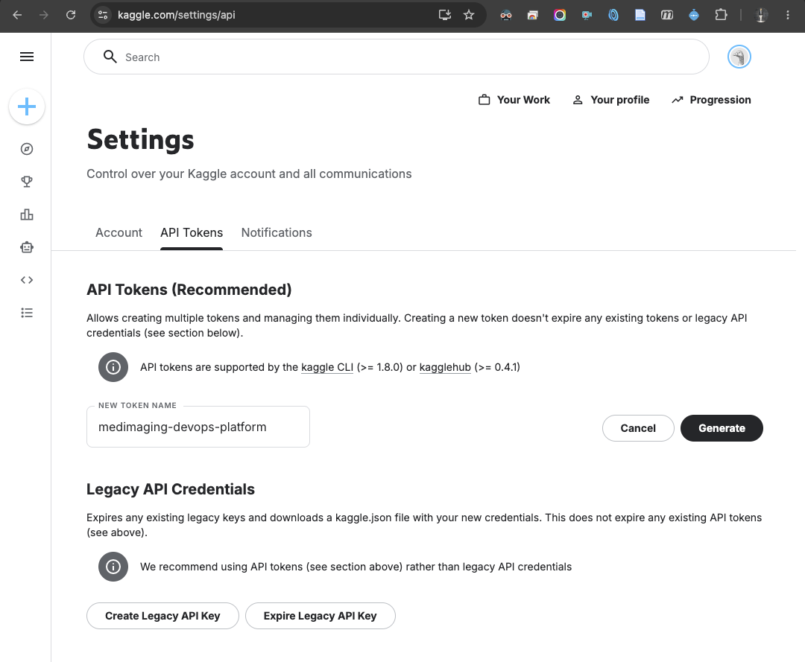

### Picking 24 balanced samples

The dataset's own `sample_labels.csv` lists every image's `Finding Labels` and `Patient ID`. 24 rows were picked out of the full 5,606 using a small one-off selection script (not committed - its output is what became the manifest below): 12 images labeled exactly `No Finding`, and 12 images each labeled with exactly one abnormal finding, covering 12 different findings rather than repeating the same one:

```text
Infiltration, Effusion, Atelectasis, Nodule, Pneumothorax, Mass,
Consolidation, Pleural_Thickening, Cardiomegaly, Emphysema, Edema, Pneumonia
```

Every one of the 24 comes from a different patient, so the set isn't accidentally weighted toward one person's anatomy or imaging equipment. The result is a tracked manifest, `evaluation/manifest.csv`, with one row per sample:

```text
sample_id, source_filename, expected_label, expected_group, local_path, reason_selected
```

The first few rows look like this:

```text
xray-eval-abnormal-01,00000181_017.png,Infiltration,abnormal,sample-data/downloads/xray-eval/00000181_017.png,"single clear finding (Infiltration), chosen to cover a distinct pathology not already represented in this set"
xray-eval-abnormal-02,00000061_002.png,Effusion,abnormal,sample-data/downloads/xray-eval/00000061_002.png,"single clear finding (Effusion), chosen to cover a distinct pathology not already represented in this set"
xray-eval-normal-01,00000017_001.png,No Finding,normal,sample-data/downloads/xray-eval/00000017_001.png,"labeled No Finding, chosen from a different patient than every other sample in this set"
```

The 24 image files themselves are not committed (same rule as every other sample in this project - see `docs/sample-data.md`), only the manifest that describes them. A new script downloads them on demand, one file at a time by name, using the Kaggle CLI and the token above:

```bash
./scripts/download-xray-evaluation-set.sh
```

### The batch evaluation script

A new `evaluation/run_evaluation.py` reads the manifest, registers each of the 24 images as its own study (the same pattern `register_xray_samples.py` already used for the original two samples), then calls the API's own `POST /studies/{id}/infer` for each one - the same endpoint the dashboard's "Run AI Demo Inference" button uses. That single call already runs the real model, builds a heatmap, uploads it to MinIO, and stores a row in `ai_results`; this script's only new job is judging that result against the sample's known label.

Two match rules, one for each group, decide whether a result counts as a match:

```python
def judge(row, result, threshold):
    probabilities = result.get("finding_probabilities") or {}
    top_findings = [f["label"] for f in result.get("top_findings", [])]

    if row["expected_group"] == "abnormal":
        expected_prob = probabilities.get(row["expected_label"])
        in_top_k = row["expected_label"] in top_findings
        above_threshold = expected_prob is not None and expected_prob >= threshold
        deciding_prob = expected_prob
        is_match = in_top_k or above_threshold
    else:
        deciding_prob = max(probabilities.values()) if probabilities else None
        is_match = deciding_prob is not None and deciding_prob < threshold

    if is_match:
        return "match", deciding_prob
    if deciding_prob is not None and abs(deciding_prob - threshold) <= REVIEW_BAND:
        return "review_needed", deciding_prob
    return "mismatch", deciding_prob
```

An abnormal sample matches if its expected finding shows up anywhere in the model's top 5 answers, or its own probability clears the 0.5 threshold already established in `docs/ai-model-config.md` - either is a real catch. A normal sample matches only if nothing at all clears that same threshold. A third outcome, `review_needed`, catches results sitting within 0.05 of the threshold either way - genuinely borderline calls that shouldn't be forced into a clean match or a clean miss.

A new table stores one row per sample per run:

```sql
CREATE TABLE IF NOT EXISTS xray_evaluation_results (
    id SERIAL PRIMARY KEY,
    sample_id TEXT NOT NULL,
    orthanc_study_id TEXT NOT NULL,
    ai_result_id INTEGER,
    expected_label TEXT NOT NULL,
    expected_group TEXT NOT NULL,
    top_finding TEXT,
    top_confidence DOUBLE PRECISION,
    confidence_bucket TEXT,
    match_status TEXT NOT NULL,
    inference_time_ms DOUBLE PRECISION,
    threshold_used DOUBLE PRECISION NOT NULL,
    finding_probabilities JSONB,
    created_at TIMESTAMPTZ NOT NULL DEFAULT now()
);
```

`finding_probabilities` keeps all 18 of the model's raw scores for every sample, not just its top 5 - that's what lets the threshold sensitivity check below re-judge every result at other thresholds without calling the model again.

### Running it for real

With the stack up, the script was run from the repo root:

```bash
python3 evaluation/run_evaluation.py
```

Each of the 24 samples gets registered and judged one at a time, ending in the summary and threshold sensitivity numbers discussed below:


### What the results actually showed

At the project's existing 0.5 threshold, 10 of the 24 samples matched, 7 needed review, and 7 were clean mismatches:

```text
=== Evaluation summary (threshold = 0.5) ===
Total samples:   24
Normal:          12
Abnormal:        12
Match:           10
Review needed:   7
Mismatch:        7

Average inference time: 140.4 ms
```

10 of the 12 abnormal samples matched, including one, `Nodule`, that only matched because it showed up in the top 5 rather than clearing the threshold on its own (its own probability was 0.33) - a real example of why the top-5 half of the match rule matters, the same way a radiologist's differential list includes runner-up possibilities, not only the single most likely one. The two abnormal samples that did not match, `Pleural_Thickening` and `Pneumonia`, were not borderline calls: the model's own probability for each expected finding was 0.20 and 0.002, genuinely low rather than close to the line.

The normal samples are where the model's real weak spot shows up: only 3 of the 12 "No Finding" images cleanly matched. On most of the rest, the model's own top call landed at or just past the 0.5 threshold anyway (a cluster of "Infiltration" and "Lung Opacity" calls around 0.50-0.57), meaning this model, with no further adjustment, leans toward flagging something even on a healthy-looking image more often than it stays quiet. The full breakdown and discussion is in `docs/ai-evaluation-notes.md`, written specifically so this result is stated plainly rather than glossed over.

The same 24 stored results were then re-judged at two other thresholds, using the probabilities already saved rather than running inference again:

```text
=== Threshold sensitivity (recomputed from stored probabilities) ===
 threshold   match   review   mismatch
       0.5      10        7          7
       0.6      16        2          6
       0.7      18        0          6
```

0.5 (the threshold already established for the live model back in Step 24) was kept as the number used everywhere else in this step, even though 0.7 makes the summary look better on its face - moving the threshold mostly reclassifies borderline normal-sample calls from "review needed" into "match," it does not change the two genuine abnormal misses, which stay mismatched at every threshold tried. Picking whichever threshold produced the best-looking summary would have hidden the model's actual weak spot instead of reporting it honestly.

### Dashboard and storage

Two new endpoints expose this data:

```text
GET /evaluation/summary
GET /evaluation/samples
```

The dashboard's existing "AI Model Configuration" panel stays exactly where it was; a new "X-ray Model Evaluation" panel sits directly under it, showing the same summary numbers above, and a full table below with every sample's expected label, top finding, confidence, bucket, match/review/mismatch flag, inference time, and a small heatmap thumbnail:


Scrolling through the same table shows every one of the 24 rows, with the green Match, red Mismatch, and yellow Review badges all visible side by side - including the normal samples' weak spot discussed above, not just the wins:

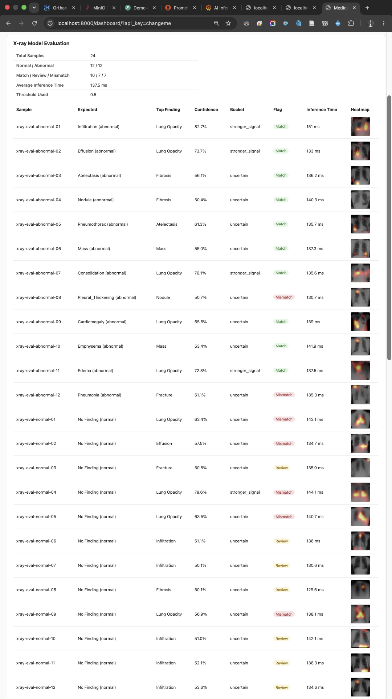

Every evaluation row shown above is a real row in Postgres, queried directly:

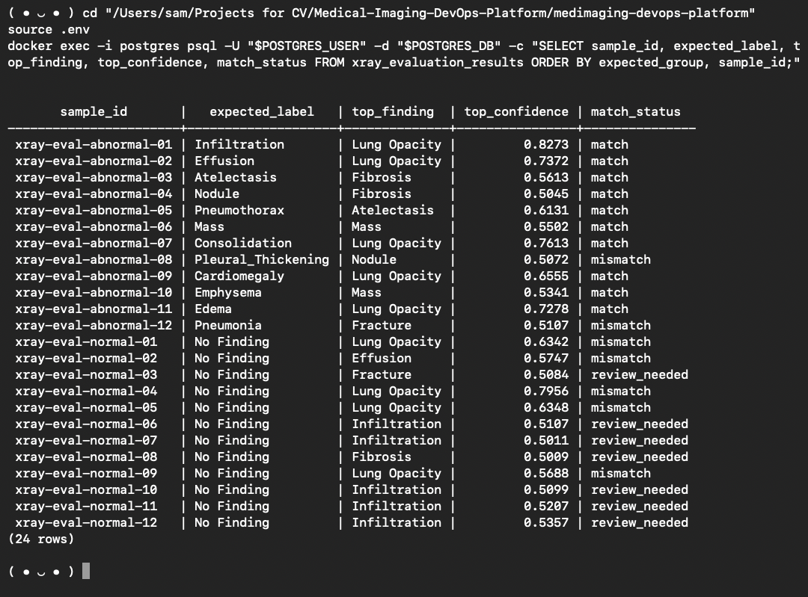

And every heatmap thumbnail shown above is a real object in MinIO's `heatmaps/` folder, not just a path string - the object browser lists all of them, with one open in a preview popup:

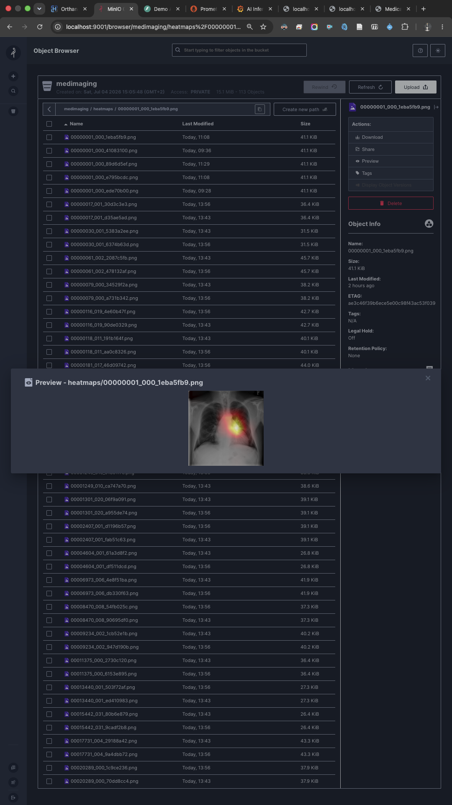

Seven new pytest tests cover the `judge()` match rules and `confidence_bucket()` directly, using small hand-built result dictionaries rather than a live model or database - the abnormal top-k-vs-threshold case, a clean abnormal miss, a normal match, a normal false-positive-style mismatch, and a borderline review-needed case are all covered on their own, along with the bucket boundaries. `evaluation/` also got its own line in the CI workflow, so its dependencies are installed and its files are syntax-checked the same way every service already is.

Nothing about how a single, live inference request behaves changed in this step - the same `POST /studies/{id}/infer` endpoint, the same heatmap generation, the same `ai_results` storage from Steps 21-25 all work exactly as before. This step only adds a batch way of running that same path 24 times and keeping score.

## Step 27 - Getting Ready to Deploy

In this step, a plan was written down for moving this stack off this Mac and onto a rented server with a GPU - what that would actually take, without renting anything or deploying anything yet.

Step 26 was the first time this project actually measured how good the AI model is - 10 of 24 samples matched, with a real weak spot showing up in the results. That's why this step comes right after it: it made sense to understand the model's real behavior before spending money on a GPU server to run it.

Two new docs cover the plan. `docs/deployment.md` covers everything that isn't GPU-specific:

```text
Docker Compose deployment flow
Persistent volumes
Model weight/cache handling
Backup before deployment
Restore check after deployment
Firewall ports
Reverse proxy / HTTPS plan
Secrets handling
Public demo limitations
```

`docs/gpu-demo-plan.md` covers the GPU-specific half on its own, since the rest of the stack (Orthanc, Postgres, MinIO, the API, monitoring) never needs a GPU regardless of what happens with `ai-inference`:

```text
Local Mac ARM64 vs cloud GPU amd64 difference
CPU mode vs GPU mode for ai-inference
NVIDIA Container Toolkit requirement
nvidia-smi check
Docker Compose deployment flow (GPU)
Expected VPS/GPU resource table
```

The architecture difference is a real, checkable fact, not a guess - this Mac's own Docker reports its actual platform:

```text
$ uname -m
arm64

$ docker info --format '{{.OSType}}/{{.Architecture}}'
linux/aarch64
```

Every image built here so far is arm64. A rented GPU server is almost always amd64/x86_64 instead, so the image would need rebuilding there, not copied over - Docker images are tied to one CPU architecture.

The resource table in `docs/gpu-demo-plan.md` uses real numbers pulled from this Mac's own Docker install (`docker images`, `docker stats`), not estimates - each service's actual built image size and its actual idle memory use, so the plan is grounded in what this stack really costs to run today rather than a guess about what a bigger deployment might need.

Three example files back up the docs, all clearly named so nothing gets mistaken for something already in use:

```text
.env.production.example
docker-compose.prod.example.yml
docker-compose.gpu.example.yml
```

Writing `docker-compose.prod.example.yml` turned up a real, worth-knowing fact about how Docker Compose actually works: an override file can't unpublish a port the base file already defines. Compose merges the `ports` list across files by appending to it, not replacing it - checked directly with `docker compose config` rather than assumed. An override that tried `ports: []` left every base port exactly as it was; one that tried rebinding the API to `127.0.0.1` ended up with *both* that binding and the original public one active side by side, not a real restriction. Closing a port to the public internet on a real server is a firewall job (the cloud provider's security group, or `ufw`/`iptables` on the host), not something a Compose override file can do on its own - `docs/deployment.md`'s "Firewall ports" section and the compose file's own comments both say so plainly, and the file itself only overrides what Compose actually can change safely (restart policy).

A new script, `scripts/deployment/preflight-check.sh`, is a read-only readiness check - it never deploys or changes anything, only reports what it finds: Docker and Compose versions, host/engine architecture, whether `nvidia-smi` is available, whether `.env.production` exists and still has leftover placeholder values (checked by key name only, never printing an actual secret), whether the two example compose files still parse correctly alongside the base file, and available disk space. Running it on this Mac today, before any server exists, shows exactly the state expected - no GPU, arm64, no production env file yet:


Before renting an actual GPU server, the plan calls for: a fresh backup of the current stack (`scripts/backup/backup.sh`), a real `.env.production` with generated secrets that are different from the local demo ones, the NVIDIA Container Toolkit installed and confirmed with `nvidia-smi` on the host itself, and a restore test run on the new server before trusting it with anything - all covered in the two new docs, none of it done yet. No server was rented, nothing was deployed, and no domain or certificate exists - this step is the plan, not the move.

## Step 28 - A Clinic Workflow Demo

In this step, two new browser pages were added so the platform tells a small, complete story for the project's demo video: a radiographer uploads a new chest X-ray, the platform processes it, and a doctor opens a review page and sees the image, the AI's findings, its heatmap, and the audit trail.

Everything in this step reuses what already existed - the same `studies` table, the same AI inference path, the same MinIO storage, the same audit logging. Only one truly new piece was needed: a way to actually get a new image into the platform from a browser, since every study so far had come from a script or a direct Orthanc upload, never a web form.

That one new piece is `POST /studies/upload`, a multipart form endpoint that takes a plain image file straight from a browser:

```python
@app.post("/studies/upload")
async def upload_study(
    request: Request, file: UploadFile = File(...), label: str = Form(""),
    auto_ai: str | None = Form(None),
):
    study_id = f"clinic-upload-{uuid.uuid4().hex[:8]}"
    ...
```

It walks the upload through four real stages, writing the current one to a new `workflow_status` column after each: `received` as soon as the study row exists, `stored` once the file is in MinIO, `ai_processing` right before calling the same `/infer` path `POST /studies/{id}/infer` already uses, and finally `ready_for_review` once a result comes back - or `failed`, with the real error saved to `last_error`, if anything after storage goes wrong. This column is separate from `processing_status`/`anonymization_status`/`preview_status`/`upload_status`, which belong to the older DICOM pipeline from Steps 3 and 12 - a study uploaded this way never touches DICOM or anonymization, so overloading those columns would have been misleading. Every study from an earlier step just has `workflow_status = NULL`:

```sql
workflow_status TEXT
```

The failure path was checked directly, not assumed: uploading a plain text file instead of an image produced `workflow_status = 'failed'` with the real 422 error from the AI service saved in `last_error`, and the endpoint still returned a normal response instead of crashing. That test study was removed afterward so it wouldn't clutter the real demo data.

The Radiographer Upload view (`/dashboard/upload.html`) is a file-upload form with a real drag-and-drop zone - dropping a file or clicking "browse" both feed the same upload. After a real upload, it shows the stages that just ran as a small checklist, and a list of every study uploaded this way, newest first, each with a thumbnail and its current status:


The Doctor Review view (`/dashboard/review.html`) lists every study with a `workflow_status` set, newest first, next to the same "AI Model Configuration" panel the main dashboard already has. Clicking a study shows its X-ray, its AI result, and a heatmap, the same way the main dashboard's study detail panel already does - plus a confidence bucket and a review flag, using the exact same reasoning as Step 26's evaluation buckets: a top finding sitting close to the model's own 0.5 point of indifference is flagged "Review Needed," anything more clearly high or low is "Clear":

```javascript
function reviewFlag(bucket) {
  return bucket === "uncertain"
    ? '<span class="status ai_processing"><span class="dot"></span>Review Needed</span>'
    : '<span class="status ready_for_review"><span class="dot"></span>Clear</span>';
}
```

Both list views also show a "Reviewed" status once a study has actually been opened - not a new tracked flag, just a read of the same audit trail every other view already writes to:

```javascript
async function wasReviewed(studyId) {
  const response = await apiFetch(`/audit-events?study_id=${encodeURIComponent(studyId)}`);
  const events = await response.json();
  return events.some((e) => e.action === "view_study");
}
```

`GET /audit-events` gained an optional `study_id` filter for this - the same table, the same rows every endpoint already logs to, just filtered down to one study instead of the newest 50 overall. Clicking a study shows the full picture - the X-ray, the AI result, the heatmap, and the review flag - and the audit trail underneath immediately shows the `view_study` event that click just created.

### A clinic look, not just a clinic flow

To make the interface look more like a real product for the demo video, all three pages were restyled: a dark "MedSyn Lab" theme, a left sidebar, a background image, and status shown as colored dots - sharing one stylesheet, `services/api/static/theme.css`, instead of three separately styled pages. The background image (made with an AI image tool) had sidebar text baked into it, so it was cropped down to just the artwork before a real, working sidebar was built in HTML and CSS on top of it.

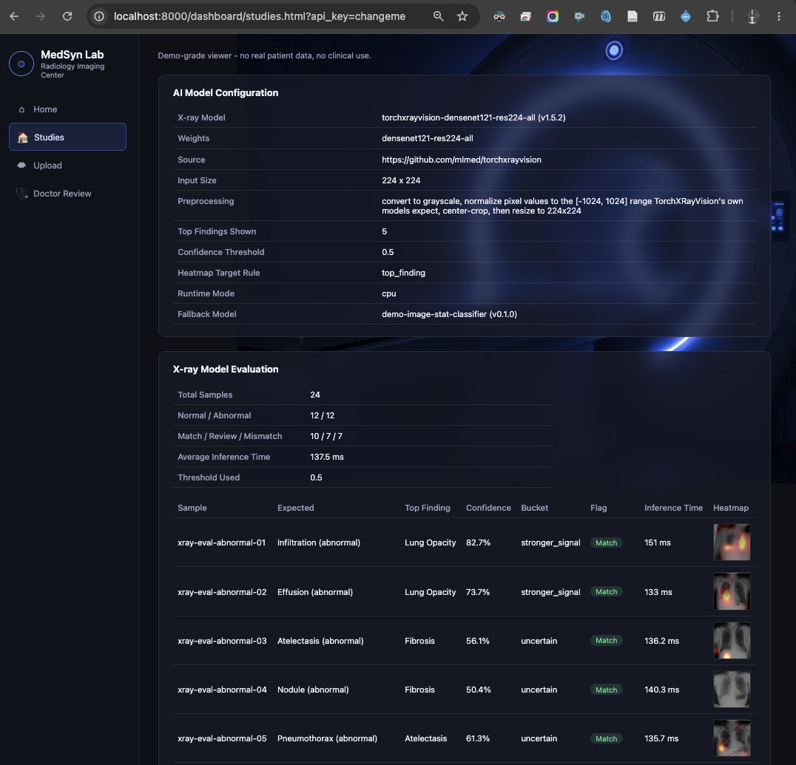

The stylesheet and background image needed to load without the API key, since the browser requests them on its own - only those two static paths were made public, every data endpoint still needs the key as before:

```python
PUBLIC_PATH_PREFIXES = ("/dashboard/theme.css", "/dashboard/images/")
```

A new script, `scripts/run-demo-workflow.sh`, uploads 3 public sample X-rays through the same upload endpoint in one run, reusing images already used in Step 26's evaluation set:

```text
Uploading 00000017_001.png (Routine chest X-ray - no prior findings noted)...
  -> clinic-upload-fda45d12 : ready_for_review
Uploading 00000079_000.png (Follow-up chest X-ray - patient reported chest discomfort)...
  -> clinic-upload-cf475df7 : ready_for_review
Uploading 00000061_002.png (Chest X-ray - shortness of breath on admission)...
  -> clinic-upload-a302e54e : ready_for_review
```

### A real home page

A second image became an actual landing page - the MedSyn Lab name, a short "Advanced Imaging Workspace" headline, and the three imaging types (X-ray, MRI, CT) laid out with connecting lines. That became the new `services/api/static/index.html`, with the old Studies dashboard renamed to `studies.html` so the address a browser lands on first (`/dashboard/`) is this landing page, not the study list. Three real links sit in the open space below the logo - Studies, Upload, Doctor Review - not baked into the picture, actual `<a>` tags styled to sit on top of it.

Nav links across all four pages needed to carry the API key forward too, since a plain `<a href="...">` doesn't include the page's own `?api_key=...` on its own:

```javascript
if (apiKey) {
  for (const link of document.querySelectorAll(".nav-links a")) {
    link.href += (link.href.includes("?") ? "&" : "?") + `api_key=${encodeURIComponent(apiKey)}`;
  }
}
```

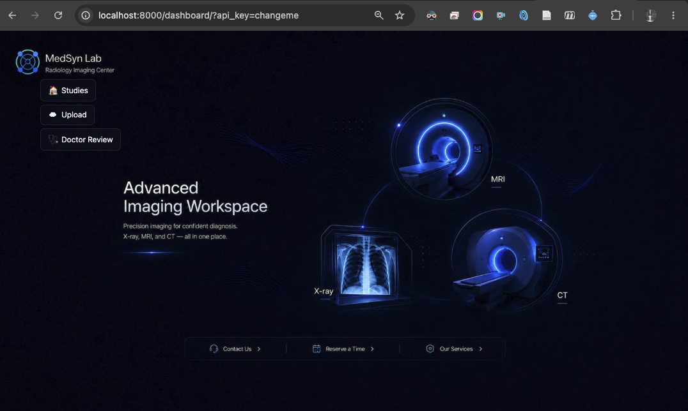

### Doctor-controlled AI review policy

AI no longer has to run automatically on every upload. A doctor can turn that off from the Doctor Review page, so a study instead waits for a doctor to run it explicitly - real control over whether AI touches a study on its own or only after a doctor chooses to run it, which matters if a department wants a human gating that step rather than letting it happen on every upload by default.

```python
APP_SETTINGS = {"auto_ai_default": True}
```

A plain in-memory value, not a new database table (same demo-grade limitation as elsewhere in this project - it resets to "on" if the API container restarts). `GET /settings` and `POST /settings` read and write it. `POST /studies/upload` falls back to this value whenever the upload request doesn't say otherwise, which is now the normal case - the Upload page no longer asks the radiographer to decide, it just shows the current policy as text:

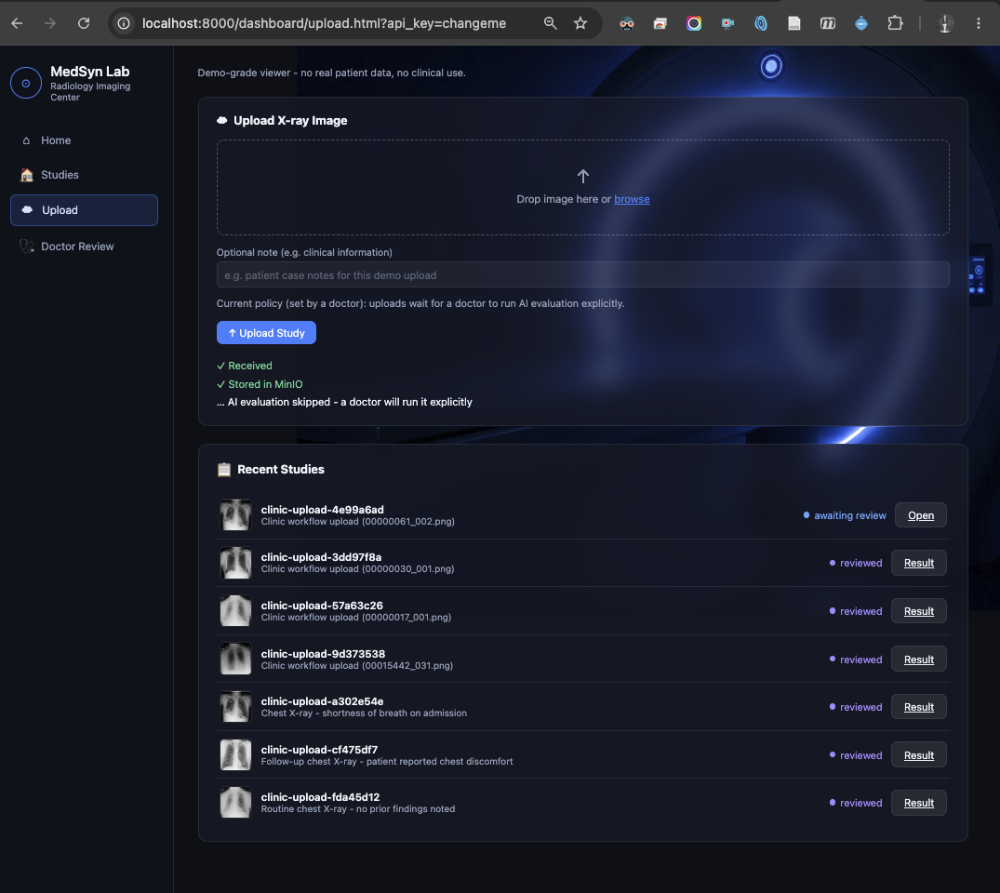

A skipped study sits at `awaiting_review` until a doctor opens it and clicks "Run AI Evaluation" - reusing the existing `POST /studies/{id}/infer` endpoint, which now also advances `workflow_status` to `ready_for_review` when called this way, the same as the automatic path already did:

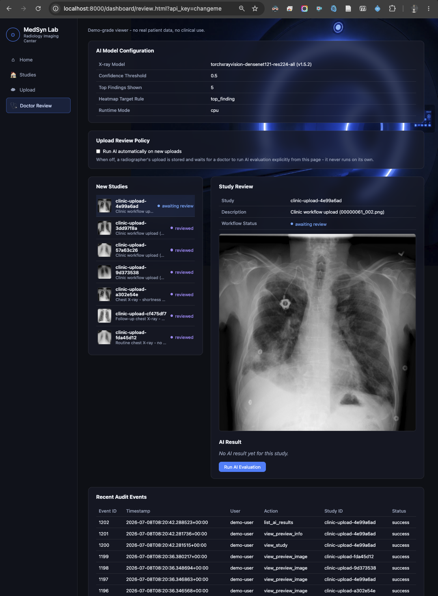

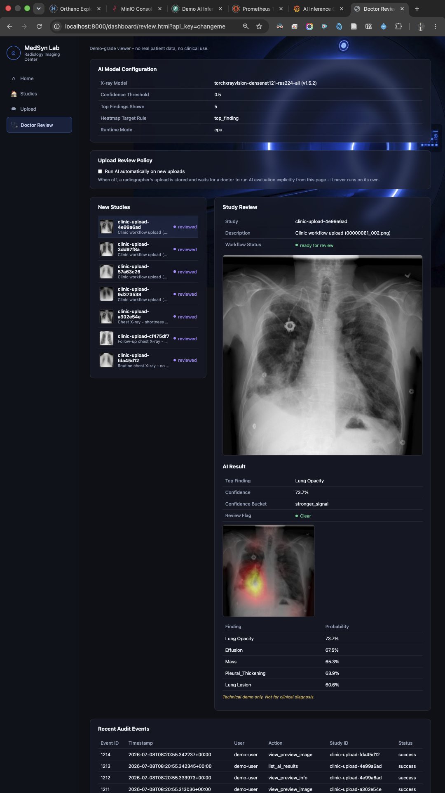

Turning the policy back on returns to the original automatic path - a new upload goes straight to "ready for review" with no button needed:

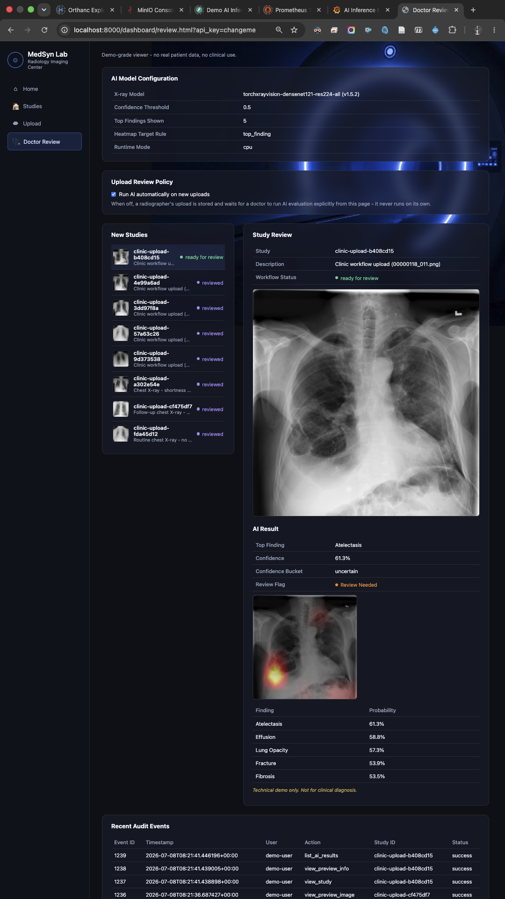

### A fifth page for ops

A fifth page, `ops.html` (Ops Dashboard), gives an ops or DevOps person direct links to every operational tool in this platform - Prometheus, Grafana, MinIO Console, Orthanc, and the API's own Swagger docs - grouped by which of three nodes each one belongs to (app, data/imaging, ops/monitoring), the same three-way split Step 29's real deployment will use:

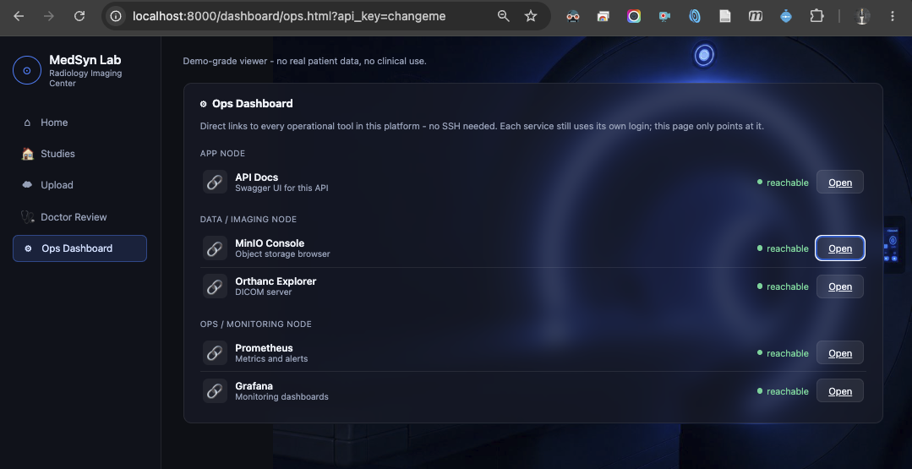

Each link's address comes from three env vars - `APP_NODE_HOST`, `DATA_NODE_HOST`, `OPS_NODE_HOST` - all defaulting to `localhost` today. Moving this to three real VPS nodes only means changing those three values, not this page or its code.

The status dot next to each link is checked from the API's own backend, not the browser, using a separate internal address for each service (Docker Compose's own service names, e.g. `http://minio:9001`) rather than the public one the "Open" button uses:

```python
{
    "name": "MinIO Console", "node": "data", "description": "Object storage browser",
    "url": f"http://{DATA_NODE_HOST}:{MINIO_CONSOLE_PORT}",
    "check_url": "http://minio:9001",
}
```

The two addresses have to be different locally: `localhost` inside the API's own container refers to the container itself, not the host machine, so a check against the public address always failed even though every service was actually running fine. Once these move to separate real VPS nodes in Step 29, both addresses converge to the same one.

## Step 29 - DICOM Pipeline Demo and Doctor-Controlled AI Review

The home page now tells the story of a chest X-ray's whole journey, one step at a time - from the moment it reaches Orthanc to the moment a doctor reads the AI's opinion of it. Ten steps make up that story, and six of them are wired to real, independently runnable scripts already living in this project:

```python
PIPELINE_STAGE_FUNCTIONS = {
    "extracted": pipeline_stage_extracted,               # services/metadata-extractor/extract.py
    "anonymized": pipeline_stage_anonymized,              # services/anonymizer/anonymize.py
    "preview": pipeline_stage_preview,                    # services/preview-generator/generate_preview.py
    "dicom_uploaded": pipeline_stage_dicom_uploaded,      # services/minio-uploader/upload.py
    "preview_uploaded": pipeline_stage_preview_uploaded,  # services/preview-generator/upload_preview.py
    "inference": pipeline_stage_inference,                # services/ai-inference/main.py
}
```

Deciding where one step ends and the next begins meant reading those scripts rather than guessing - `extract.py` finds a study and saves its metadata in the same breath, so that's one step, while `upload.py` and `upload_preview.py` turned out to be two separate scripts, each uploading one file, so storage became two steps instead of one. A pop-up on each step names its script, so a student can go open the real file.

Uploading a real DICOM file through Orthanc's own page and walking it through confirms the story is true, not staged - every step reports the real Orthanc ID, the real filenames, the real MinIO paths, and those objects are sitting in MinIO by the time it finishes.

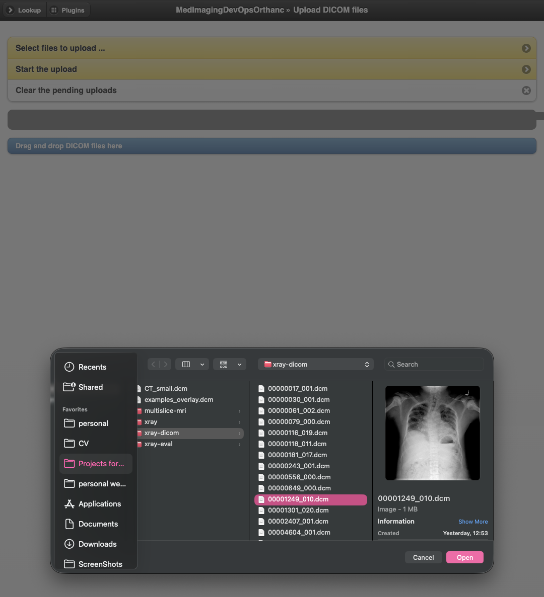

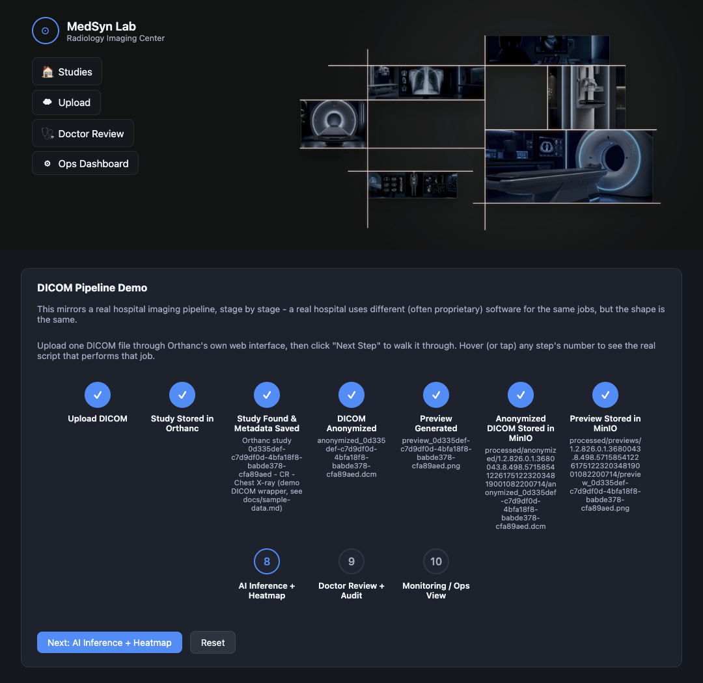

Then comes the part of the story about who's allowed to run the AI. Step 28 already let a doctor turn automatic AI review off, so a study waits for a human instead of getting read on its own. This step made sure that promise holds everywhere, not just where it was first built. The pipeline's own AI step got the same check the Doctor Review page already had:

```python
if not APP_SETTINGS["auto_ai_default"]:
    set_workflow_status(orthanc_study_id, "awaiting_review")
    return {"awaiting_doctor_review": True}
```

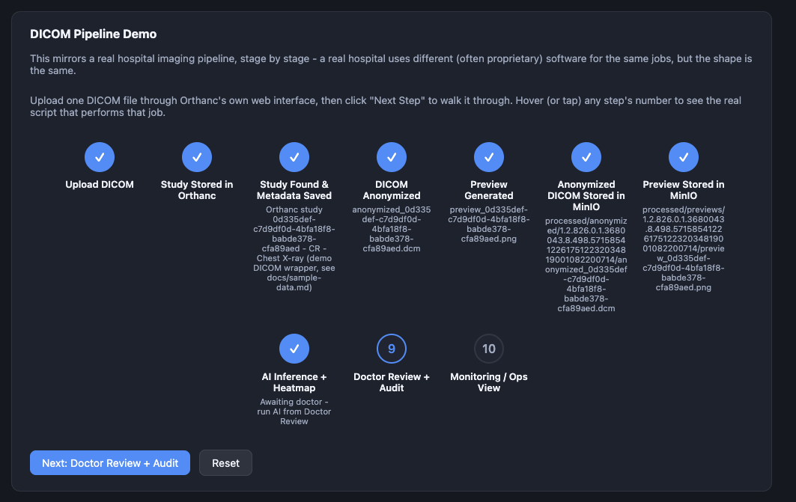

Doctor Review itself had a smaller problem hiding in it: its "Run AI Evaluation" button only appeared when a study had no result on file yet, and a study can end up carrying an old result while it's still genuinely waiting on a doctor. So the button was changed to follow the study's own status instead of its history - if it's `awaiting_review`, the button is there, no matter what else is on record for it.

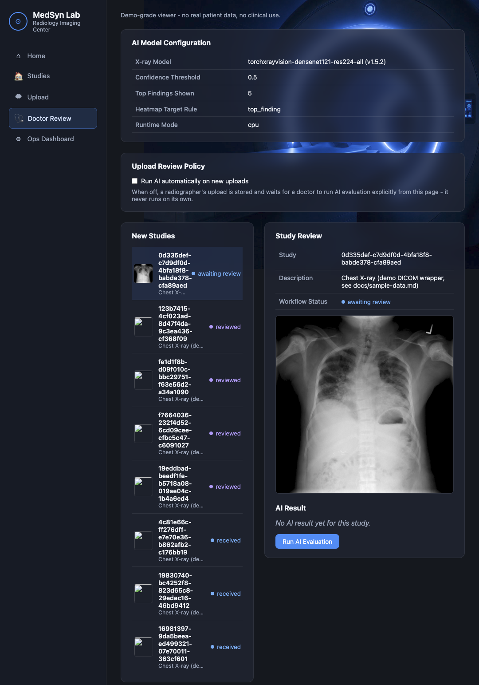

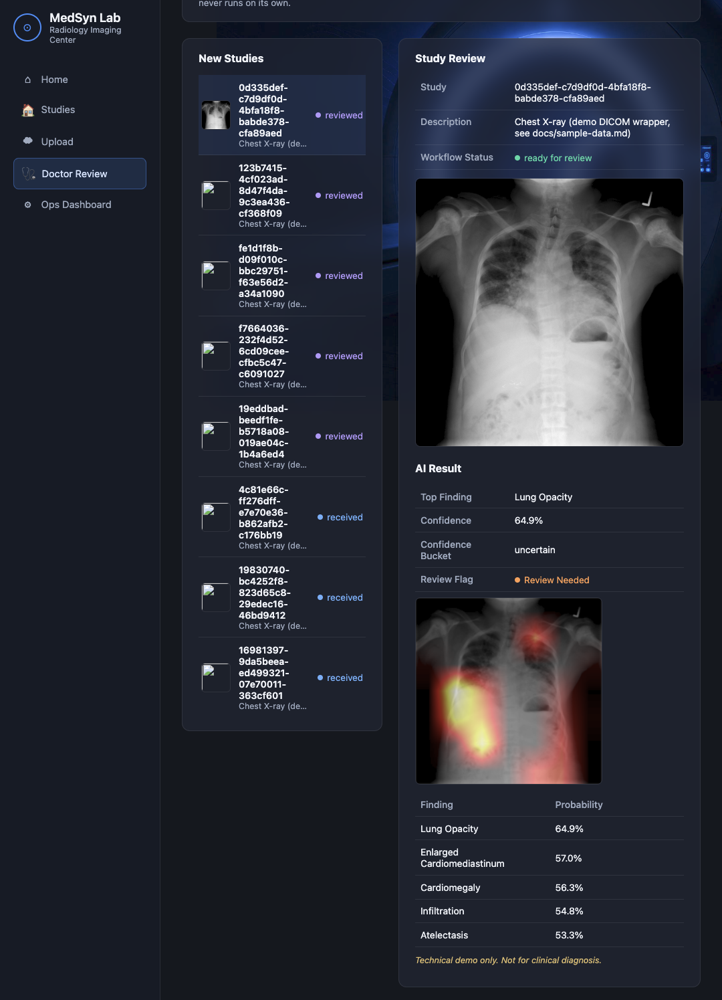

Turn automatic review back on, and none of this shows up - AI runs the moment a study reaches that step, same as before.

Prometheus and Grafana back the story up from the outside: both services healthy, real traffic behind every result shown above.

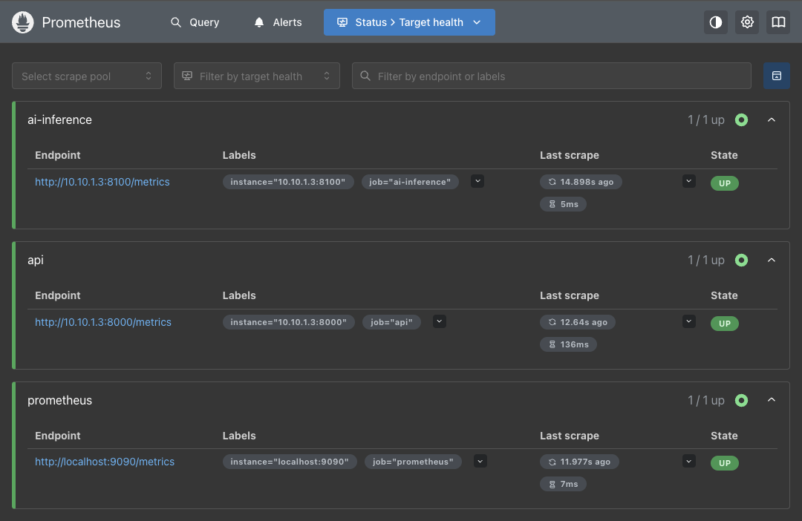

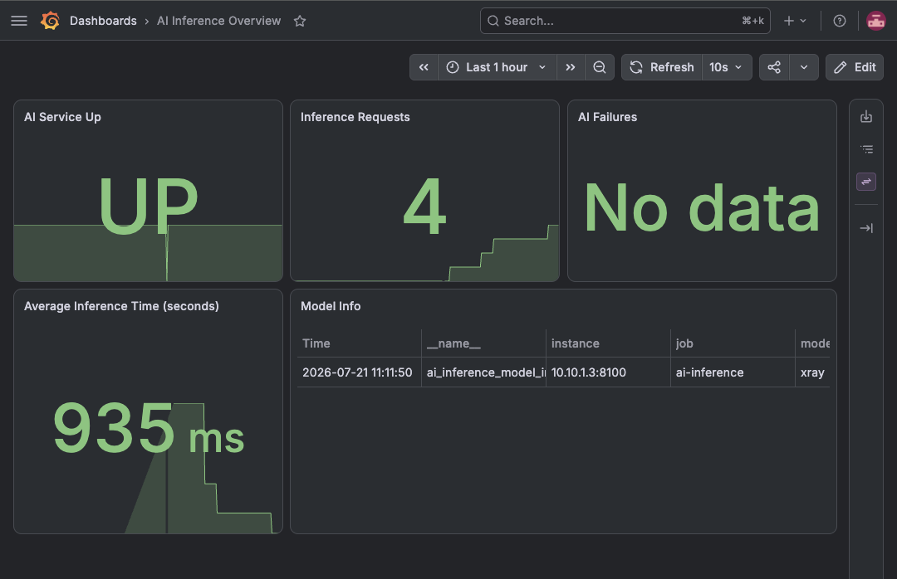

Nothing about a single, already-existing API endpoint changed behavior in this step. Every page the platform already had keeps working exactly as before; what's new is a way to get an image in from a browser, three pages built around that (upload, review, ops), a shared look across all five pages, a real home page tying them together, and a doctor-controlled switch for whether the AI step runs on its own or waits to be asked.
