# Project Record

This record documents the build of a medical imaging DevOps platform, step by step. The project will grow from a basic imaging stack into a more complete platform, with DICOM handling, storage, security, monitoring, backup, and later deployment work.

## Step 0 - Verifying the Development Environment

In this step, the local machine was checked to make sure the basic tools for the project were already installed.

Required tools:

- Git
- Docker
- Docker Compose
- VS Code

Commands used:

```bash
git --version
docker --version
docker compose version
```

All three tools were found and working. Nothing was blocking the start of the actual build.

Screenshot:

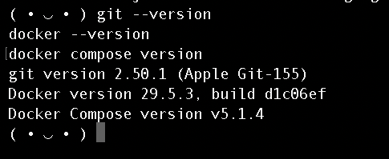

## Step 1 - Base Docker Compose Stack

In this step, the first three real services were added to Docker Compose:

```text
orthanc
postgres
minio
```

Each service got a named Docker volume, a restart policy, and a basic health check.

Orthanc's config file was added at:

```text
infra/orthanc/orthanc.json
```

This file only holds non-secret settings, like the name and AE title. The login credentials are passed in as an environment variable at container start, so they are never committed to the repo.

A small SQL file was added for PostgreSQL:

```text
infra/postgres/init.sql
```

It creates a `studies` table to hold basic imaging metadata.

`infra/minio/README.md` explains what MinIO is for, even though nothing writes to it yet.

Commands used:

```bash
docker compose config
docker compose up -d
docker compose ps
docker volume ls
```

One problem came up: the Orthanc image does not include `curl`, so the health check kept failing even though the server was working fine. It was changed to use `python3` instead, which is available in the image.

All three containers came up healthy, each with its own Docker volume. Orthanc's REST API responded correctly with the configured login.

Screenshots:

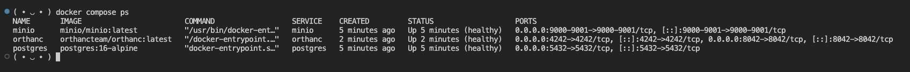

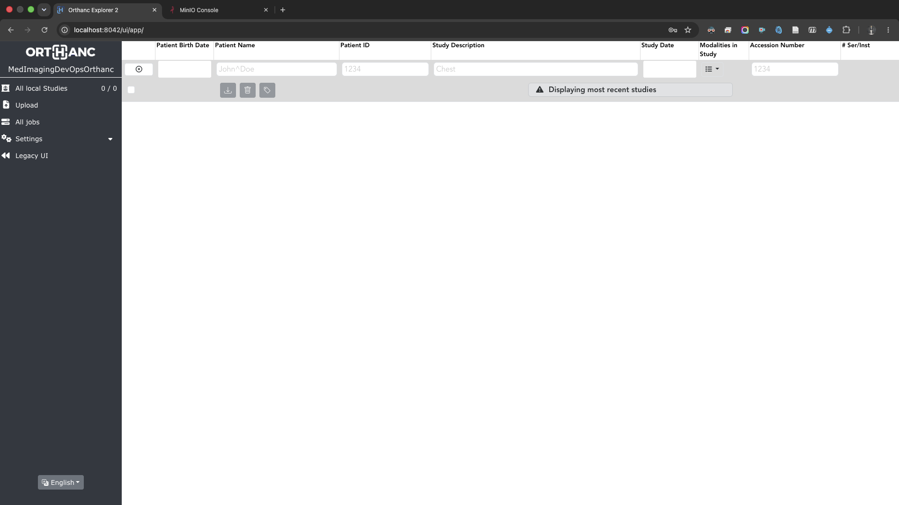

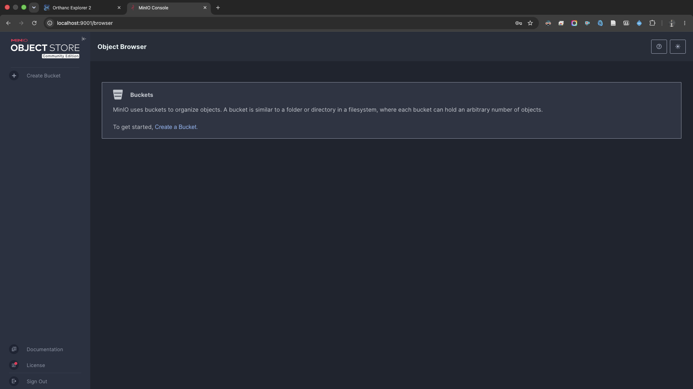

## Step 2 - Sample DICOM Upload

In this step, one small public test file was used to check that Orthanc actually receives and stores images.

```text
CT_small.dcm
```

This file comes from the pydicom project's test data. It is MIT licensed, already anonymized, and not real patient data.

A script downloads it and uploads it straight to Orthanc:

```text
scripts/upload-sample-dicom.sh
```

The file itself is not stored in this repo.

Commands used:

```bash
docker compose ps
./scripts/upload-sample-dicom.sh
curl -s -u orthanc:changeme http://localhost:8042/studies
```

The upload returned a success response, and the study showed up right away in Orthanc. The patient name and ID on the study are `CompressedSamples^CT1` and `1CT1`, the built-in test identity that ships with this file, not a real person.

Screenshot:

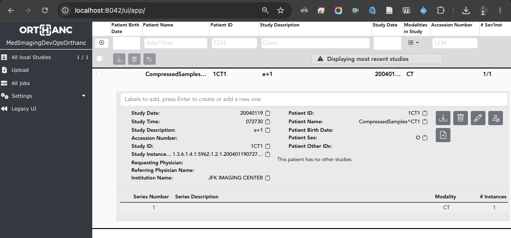

## Step 3 - DICOM Metadata Extraction

In this step, the `studies` table in PostgreSQL was extended to hold real metadata instead of a placeholder:

```text
study_instance_uid
series_instance_uid
patient_id
patient_name
modality
study_date
study_description
series_count
instance_count
processing_status
```

The table was still empty, so it was safe to drop and recreate it with this new structure.

A Python script was added to do the actual extraction:

```text
services/metadata-extractor/extract.py
```

It reads the list of studies from Orthanc's REST API, pulls the relevant DICOM tags for each one, and writes or updates a matching row in PostgreSQL. This is a manual, one-shot script for now. No background job, no API, no queue.

The script runs on the host machine, not inside a container, so it connects to Orthanc and PostgreSQL through `localhost`. This uses `ORTHANC_HOST` and `POSTGRES_HOST` from `.env`.

Commands used:

```bash
docker compose ps
python3 -m venv services/metadata-extractor/.venv
./services/metadata-extractor/.venv/bin/pip install -r services/metadata-extractor/requirements.txt
./services/metadata-extractor/.venv/bin/python services/metadata-extractor/extract.py
```

To check the result:

```bash
docker exec postgres psql -U medimaging -d medimaging -c "SELECT * FROM studies;"
```

Running the script against the demo study stored one row with patient `CompressedSamples^CT1`, modality `CT`, study date `2004-01-19`, 1 series, and 1 instance. This matches what Orthanc shows directly. Running the script again updated the same row instead of creating a new one.

Screenshots:

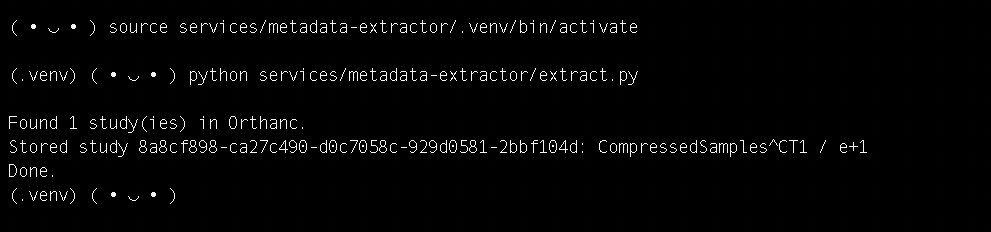

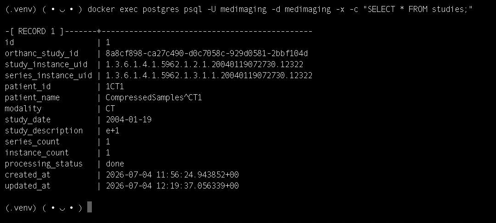

## Step 4 - DICOM Anonymization

In this step, a basic anonymization step was added before future image processing work.

The goal was simple: before a DICOM file is used for preview generation, object storage, or AI testing, sensitive patient-related fields should be replaced with safe demo values.

This project only uses public demo data, not real patient data. Still, adding anonymization early makes the project closer to a real healthcare imaging workflow.

The anonymizer was added under:

```text
services/anonymizer/
```

The main files are:

```text
anonymize.py
verify.py
rules.py
```

The anonymization rules replace fields such as:

```text
PatientName
PatientID
PatientBirthDate
AccessionNumber
InstitutionName
ReferringPhysicianName
```

The generated anonymized DICOM file is written locally to:

```text
services/anonymizer/output/
```

This output folder is ignored by Git, so generated DICOM files are not committed to the repository.

For this first version, `StudyInstanceUID` was left unchanged. This made it easier to compare the anonymized copy with the original demo study. In a stronger real-world de-identification pipeline, this value would normally need more careful handling.

Commands used:

```bash
./services/anonymizer/.venv/bin/python services/anonymizer/anonymize.py
```

To check the original file:

```bash
./services/anonymizer/.venv/bin/python services/anonymizer/verify.py sample-data/downloads/CT_small.dcm
```

To check the anonymized file:

```bash
./services/anonymizer/.venv/bin/python services/anonymizer/verify.py services/anonymizer/output/anonymized_CT_small.dcm
```

The verification showed that the selected patient-related fields were replaced with demo values. The original file in Orthanc was not changed. The anonymization was tested only on a local copy of the demo DICOM file.

Screenshots:

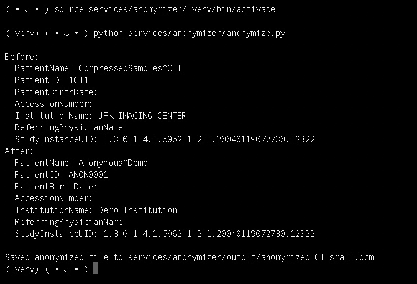

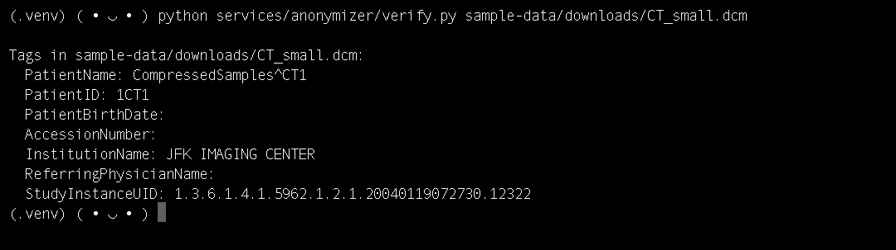

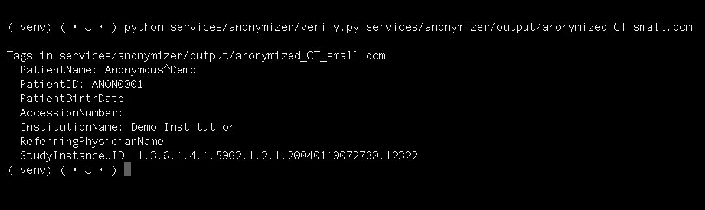

## Step 5 - Store Anonymized DICOM in MinIO

In this step, the anonymized DICOM file was uploaded to MinIO, as a processed imaging object.

A script was added under:

```text
services/minio-uploader/upload.py
```

It creates the bucket if it does not exist yet, then uploads the file. The bucket name is:

```text
medimaging
```

The object path pattern is:

```text
processed/anonymized/{study_uid}/{filename}
```

The study UID is read directly from the DICOM file itself, not typed in by hand.

Commands used:

```bash
docker compose ps
./services/anonymizer/.venv/bin/python services/anonymizer/anonymize.py
./services/minio-uploader/.venv/bin/python services/minio-uploader/upload.py
```

Running the script created the `medimaging` bucket and uploaded the file to:

```text
processed/anonymized/1.3.6.1.4.1.5962.1.2.1.20040119072730.12322/anonymized_CT_small.dcm
```

Running it a second time reused the existing bucket and just uploaded the file again to the same path. The object was also checked directly by listing the bucket's contents through the MinIO client.

Screenshot:

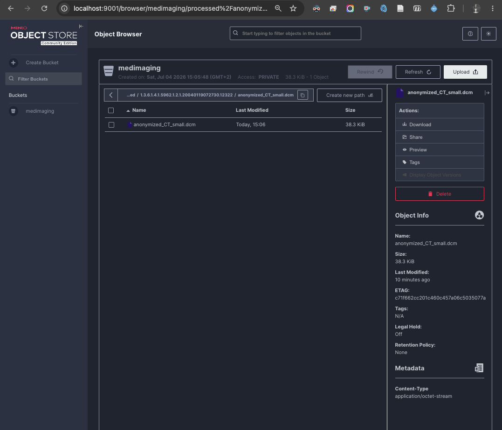

## Step 6 - Visual DICOM Preview

In this step, a PNG preview was generated from the anonymized DICOM file.

A script was added under:

```text
services/preview-generator/generate_preview.py
```

It reads the anonymized DICOM file from Step 4, applies the DICOM rescale slope/intercept plus simple windowing (`WindowCenter`/`WindowWidth` if present, otherwise a min/max stretch), and saves an 8-bit grayscale PNG with Pillow. Raw CT pixel values aren't 0-255 by default, so without this step the image would just render as solid black or white.

The PNG is written to:

```text
services/preview-generator/output/
```

This folder is git-ignored, same as the anonymizer's output folder.

A second script uploads the PNG to MinIO:

```text
services/preview-generator/upload_preview.py
```

It reads the study UID from the source DICOM file, not the PNG, and uploads to:

```text
processed/previews/{study_uid}/preview_CT_small.png
```

Commands used:

```bash
docker compose ps
./services/preview-generator/.venv/bin/python services/preview-generator/generate_preview.py
./services/preview-generator/.venv/bin/python services/preview-generator/upload_preview.py
```

The generator produced a 128x128 grayscale PNG. Opening it locally showed a clear CT cross-section, confirming the windowing worked. Listing the MinIO bucket confirmed the preview sits next to the Step 5 anonymized DICOM object.

Screenshots:

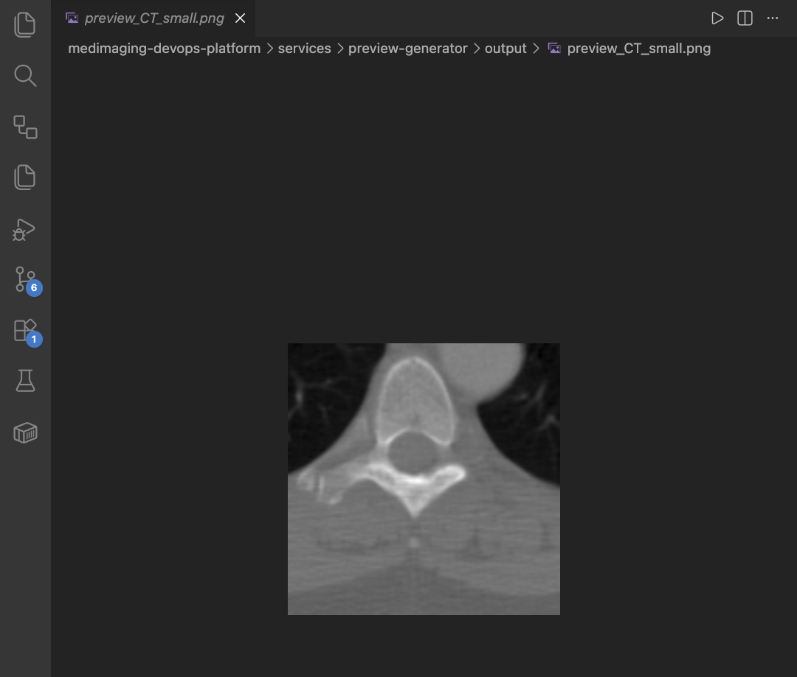

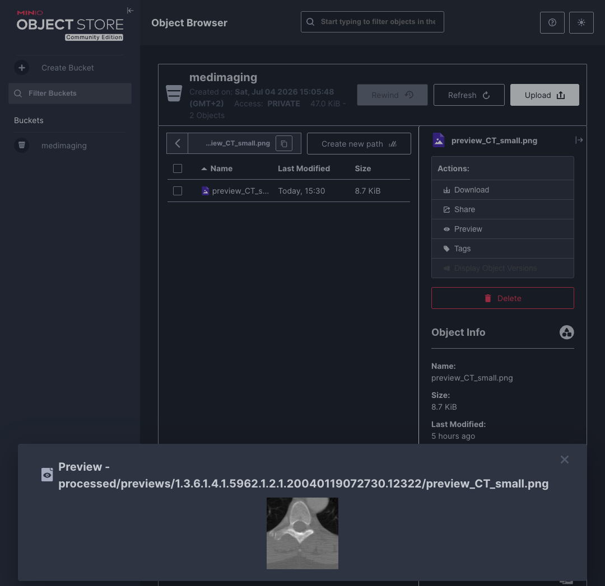

## Step 6B - Better Visual DICOM Sample

In this step, a bigger, clearer public DICOM sample replaced `CT_small.dcm` as input to the preview pipeline. `CT_small.dcm` is only 128x128, so its preview came out tiny.

A second sample was added: `examples_overlay.dcm`, also one of pydicom's bundled test files. It's a cropped copy of a real Siemens abdominal MR slice, originally from the GDCM project (BSD-style license), 300x484 pixels. Source and license details are in `docs/sample-data.md`.

A download script was added:

```text
scripts/download-better-dicom-sample.sh
```

It downloads the file into `sample-data/downloads/` (git-ignored) and does not touch Orthanc.

The raw file's `InstitutionName` tag was `AKH - WIEN`, a real hospital name. Running the Step 4 anonymizer on it replaced this with `Demo Institution`, the same as it does for `CT_small.dcm`.

`services/preview-generator/upload_preview.py` was updated to work out the matching anonymized DICOM file from whatever PNG path it's given, instead of a hardcoded filename, so the same script works for both samples.

Commands used:

```bash
docker compose ps
./scripts/download-better-dicom-sample.sh
./services/anonymizer/.venv/bin/python services/anonymizer/anonymize.py sample-data/downloads/examples_overlay.dcm
./services/preview-generator/.venv/bin/python services/preview-generator/generate_preview.py services/anonymizer/output/anonymized_examples_overlay.dcm
./services/preview-generator/.venv/bin/python services/preview-generator/upload_preview.py services/preview-generator/output/preview_examples_overlay.png
```

The new PNG (300x484) shows a real anatomical image - liver, kidneys, spine, and aorta are all visible. Listing the bucket confirmed all three processed objects sit side by side: the Step 5 anonymized DICOM, the Step 6 CT preview, and the new MR preview.

Screenshot:

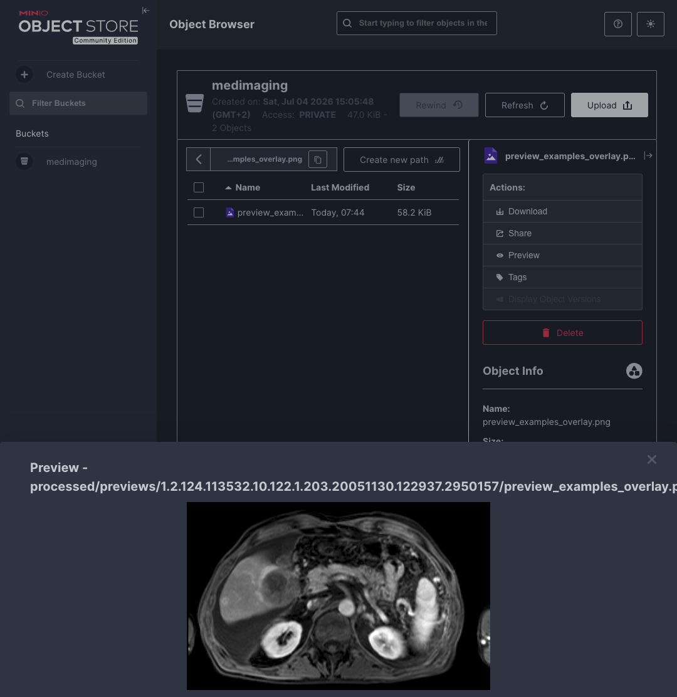

## Step 7 - FastAPI Study API

In this step, a small read-only API was added in front of the `studies` table.

A new service was added under:

```text
services/api/
```

It's a FastAPI app (`main.py`, `Dockerfile`, `requirements.txt`). It connects to PostgreSQL using the `postgres` service name, the same pattern the other containers already use.

It was added to `docker-compose.yml` as a fourth service:

```yaml
api:
  build:
    context: ./services/api
  container_name: api
  restart: unless-stopped
  ports:
    - "${API_PORT:-8000}:8000"
  environment:
    POSTGRES_HOST: postgres
    POSTGRES_PORT: 5432
    POSTGRES_DB: ${POSTGRES_DB}
    POSTGRES_USER: ${POSTGRES_USER}
    POSTGRES_PASSWORD: ${POSTGRES_PASSWORD}
  depends_on:
    postgres:
      condition: service_healthy
```

Four endpoints:

```text
GET /health
GET /studies
GET /studies/{orthanc_study_id}
GET /studies/{orthanc_study_id}/preview-info
```

`preview-info` needed somewhere to read the MinIO object path from, so a `preview_object_path` column was added to the `studies` table:

```sql
ALTER TABLE studies ADD COLUMN IF NOT EXISTS preview_object_path TEXT;
```

This was run directly against the live database, and also added to `infra/postgres/init.sql` for fresh setups.

A small script fills that column in:

```text
services/metadata-extractor/set_preview_path.py
```

It takes an optional study UID and object path, and updates the matching row. No auth, no RBAC, no dashboard, no AI were added, per the task.

Commands used:

```bash
docker exec postgres psql -U medimaging -d medimaging -c "ALTER TABLE studies ADD COLUMN IF NOT EXISTS preview_object_path TEXT;"
./services/metadata-extractor/.venv/bin/python services/metadata-extractor/set_preview_path.py
docker compose up -d --build api
curl http://localhost:8000/health
curl http://localhost:8000/studies
curl http://localhost:8000/studies/{orthanc_study_id}
curl http://localhost:8000/studies/{orthanc_study_id}/preview-info
```

The API was checked manually through the browser: Swagger UI lists all four endpoints, `/studies` shows the real demo study with its `preview_object_path`, and `/studies/{id}/preview-info` shows that same path with `"available": true`. A bad study ID was also tried and correctly returned a 404. The results are shown in the screenshots below.

Screenshots:

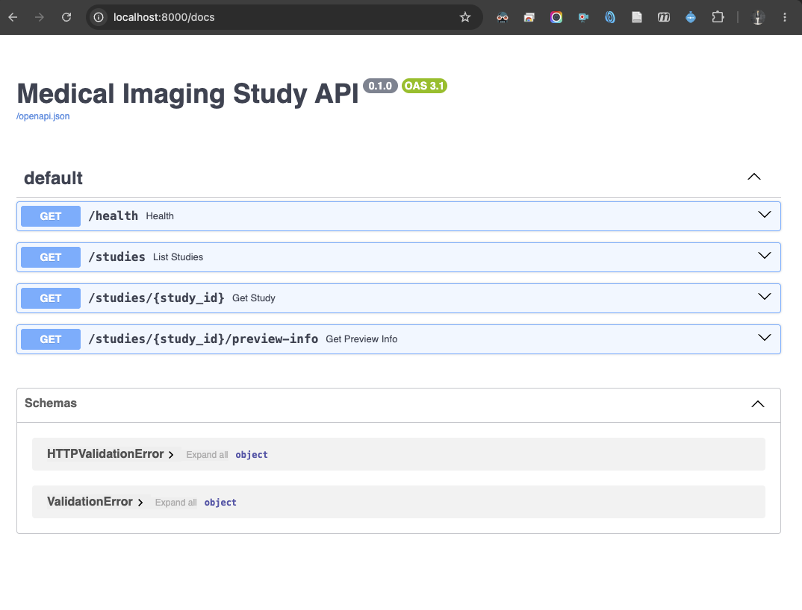

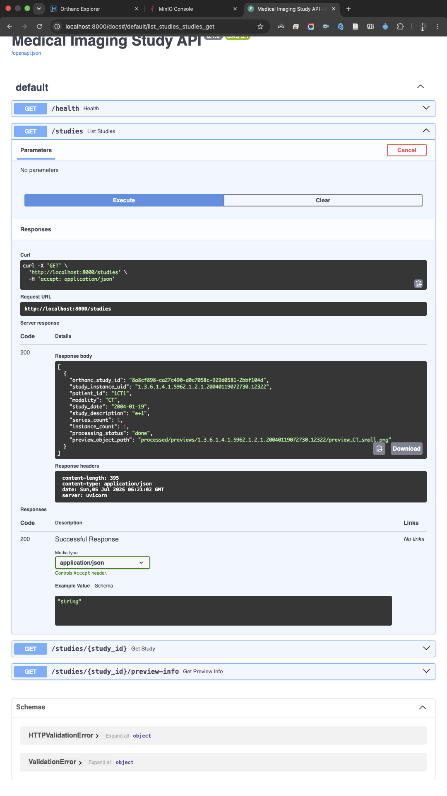

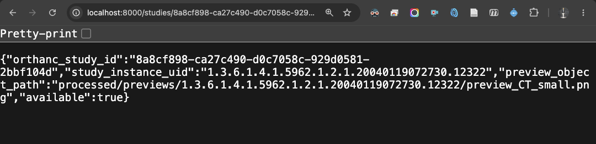

## Step 8 - Simple Imaging Dashboard

In this step, a small dashboard was added so studies can be browsed visually instead of through curl or Swagger.

It's served by the same FastAPI service, as static files under:

```text
services/api/static/
```

Files:

```text
index.html
style.css
app.js
```

Plain HTML, CSS, and vanilla JavaScript - no framework. The files are served by mounting this folder in `main.py`:

```python
app.mount("/dashboard", StaticFiles(directory="static", html=True), name="dashboard")
```

The page fetches `GET /studies` to build a table on the left. Clicking a row fetches `GET /studies/{id}` and `GET /studies/{id}/preview-info` and fills in a detail panel on the right, including the preview image.

MinIO's bucket is private, so the browser can't load the preview image directly from MinIO. A new endpoint streams it through the API instead:

```python
@app.get("/studies/{study_id}/preview-image")
def get_preview_image(study_id: str):
    study = fetch_study(study_id)
    object_path = study["preview_object_path"]
    if not object_path:
        raise HTTPException(status_code=404, detail="No preview available for this study")

    client = get_minio_client()
    try:
        response = client.get_object(MINIO_BUCKET, object_path)
    except S3Error as exc:
        raise HTTPException(status_code=404, detail="Preview object not found in MinIO") from exc

    def iter_content():
        try:
            yield from response.stream(32 * 1024)
        finally:
            response.close()
            response.release_conn()

    return StreamingResponse(iter_content(), media_type="image/png")
```

It reads the study's `preview_object_path` from Postgres, then streams the PNG bytes straight from MinIO. The dashboard's `` tag just points at this endpoint, so the browser never needs MinIO credentials.

`docker-compose.yml`'s `api` service was given MinIO connection details for this:

```yaml
MINIO_HOST: minio
MINIO_PORT: 9000
MINIO_ROOT_USER: ${MINIO_ROOT_USER}
MINIO_ROOT_PASSWORD: ${MINIO_ROOT_PASSWORD}
MINIO_BUCKET: ${MINIO_BUCKET}
```

Commands used:

```bash
docker compose up -d --build api
curl http://localhost:8000/dashboard/
curl http://localhost:8000/studies/8a8cf898-ca27c490-d0c7058c-929d0581-2bbf104d/preview-image --output test.png
file test.png
```

The dashboard was checked manually through the browser at `http://localhost:8000/dashboard/`: the study list loaded with the demo study's Orthanc ID, modality, date, patient ID, status, and preview availability, and clicking it opened the detail panel with the preview image rendered inline and the MinIO object path shown as a technical detail. The `docker compose up -d --build api` rebuild was also checked directly in the terminal. The results are shown in the screenshots below.

Screenshots:

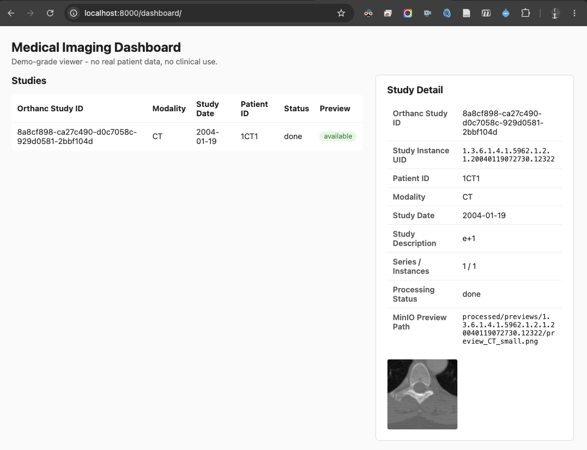

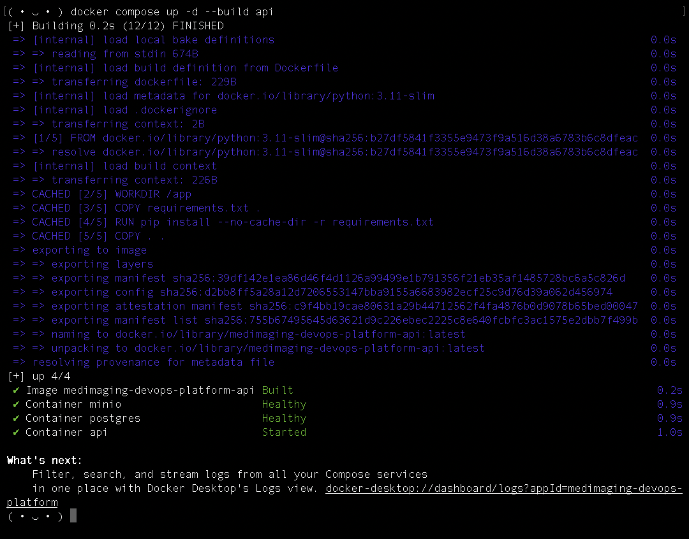

## Step 9 - Audit Trail

In this step, basic audit logging was added: a record of who looked at what, and when.

A new table was added to PostgreSQL:

```sql
CREATE TABLE IF NOT EXISTS audit_events (
    event_id SERIAL PRIMARY KEY,
    user_id TEXT NOT NULL DEFAULT 'demo-user',
    action TEXT NOT NULL,
    study_id TEXT,
    timestamp TIMESTAMPTZ NOT NULL DEFAULT now(),
    ip_address TEXT,
    status TEXT NOT NULL DEFAULT 'success'
);
```

This was run directly against the live database, and also added to `infra/postgres/init.sql` for fresh setups. There's no real login system yet, so every event is logged under one fixed `user_id`: `demo-user`.

Four existing endpoints now write a row to this table on every call:

```text
GET /studies
GET /studies/{study_id}
GET /studies/{study_id}/preview-info
GET /studies/{study_id}/preview-image
```

A small helper does the logging:

```python
def log_audit_event(request: Request, action: str, study_id, status: str):
    ip_address = request.client.host if request.client else None
    conn = get_connection()
    try:
        with conn:
            with conn.cursor() as cur:
                cur.execute(
                    """
                    INSERT INTO audit_events (user_id, action, study_id, ip_address, status)
                    VALUES (%s, %s, %s, %s, %s)
                    """,
                    (DEMO_USER_ID, action, study_id, ip_address, status),
                )
    finally:
        conn.close()
```

Each endpoint calls this with `status` set to `"success"` when the study/preview was found, or `"not_found"` when it wasn't - so a bad study ID still gets logged, not just successful lookups.

A new endpoint reads the log back:

```text
GET /audit-events
```

It returns the 50 most recent events, newest first. The dashboard also got a small "Recent Audit Events" table at the bottom of the page, showing the same data, refreshed after every study list load or detail click.

Commands used:

```bash
docker exec postgres psql -U medimaging -d medimaging -c "CREATE TABLE IF NOT EXISTS audit_events (event_id SERIAL PRIMARY KEY, user_id TEXT NOT NULL DEFAULT 'demo-user', action TEXT NOT NULL, study_id TEXT, timestamp TIMESTAMPTZ NOT NULL DEFAULT now(), ip_address TEXT, status TEXT NOT NULL DEFAULT 'success');"
docker compose up -d --build api
curl http://localhost:8000/studies
curl http://localhost:8000/studies/8a8cf898-ca27c490-d0c7058c-929d0581-2bbf104d
curl http://localhost:8000/studies/8a8cf898-ca27c490-d0c7058c-929d0581-2bbf104d/preview-info
curl http://localhost:8000/studies/8a8cf898-ca27c490-d0c7058c-929d0581-2bbf104d/preview-image
curl http://localhost:8000/studies/does-not-exist
curl http://localhost:8000/audit-events
docker exec postgres psql -U medimaging -d medimaging -c "SELECT event_id, action, study_id, status, timestamp FROM audit_events ORDER BY event_id;"
```

This was checked manually: hitting the four endpoints (including one deliberately bad study ID) produced five rows in `audit_events`, matching what `/audit-events` and a direct query on the table both showed - four `success` events plus one `not_found` for the bad ID. The results are shown in the screenshots below.

Screenshots:

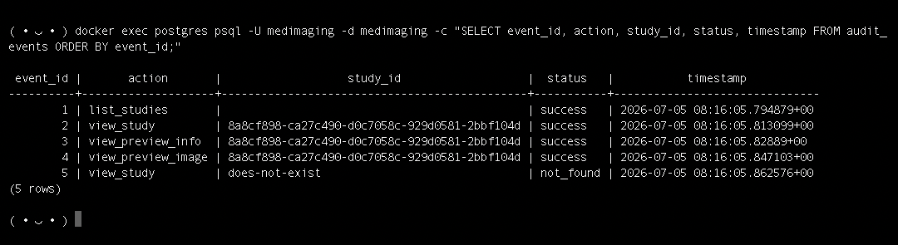

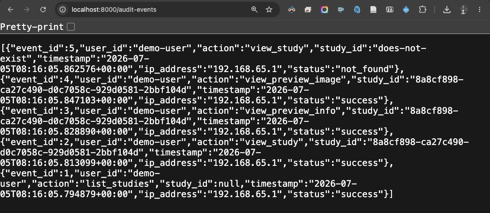

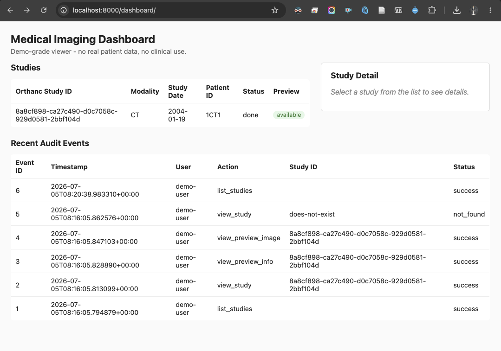

## Step 10 - Basic API Key Security

In this step, a simple API key was added in front of the API and dashboard.

The key comes from an environment variable that was already sitting unused in `.env.example` since Step 7:

```text
API_SECRET_KEY=changeme
```

It's passed into the `api` container in `docker-compose.yml`:

```yaml
API_SECRET_KEY: ${API_SECRET_KEY}
```

A single middleware checks every request:

```python
@app.middleware("http")
async def require_api_key(request: Request, call_next):
    if request.url.path in PUBLIC_PATHS:
        return await call_next(request)

    provided_key = request.headers.get("X-API-Key") or request.query_params.get("api_key")

    if not provided_key:
        return JSONResponse(status_code=401, content={"detail": "Missing API key"})
    if provided_key != API_SECRET_KEY:
        return JSONResponse(status_code=403, content={"detail": "Invalid API key"})

    return await call_next(request)
```

`PUBLIC_PATHS` is `/health`, `/docs`, `/openapi.json`, and `/redoc` - everything else, including `/studies`, `/audit-events`, and `/dashboard`, needs the key. The key can be sent as an `X-API-Key` header or an `api_key` query parameter. The query parameter exists because a plain `` tag (used for the preview image) can't send a custom header.

The dashboard's own JavaScript needed a small change to keep working under this. It reads the key once from its own URL and attaches it to every API call it makes after that:

```javascript
const apiKey = new URLSearchParams(window.location.search).get("api_key") || "";

function apiFetch(url) {
  return fetch(url, { headers: { "X-API-Key": apiKey } });
}
```

So opening the dashboard now means visiting `/dashboard/?api_key=...` once instead of a plain URL.

One real problem showed up while checking a screenshot: the page loaded but stayed stuck on "Loading studies..." with no styling at all. The `<link href="style.css">` and `<script src="app.js">` tags were separate browser requests, and a browser does not carry a page's own query string over to those sub-resource requests - so `style.css` and `app.js` were hitting the API key check with no key and getting `401`, meaning the dashboard's own script never ran. The fix was to inline the CSS and JS directly into `index.html`, so the whole dashboard is one single request - the same request that already carries `?api_key=...` in its URL.

Commands used:

```bash
docker compose up -d --build api
curl http://localhost:8000/health
curl http://localhost:8000/studies
curl -H "X-API-Key: wrong-key" http://localhost:8000/studies
curl -H "X-API-Key: changeme" http://localhost:8000/studies
curl http://localhost:8000/dashboard/
curl "http://localhost:8000/dashboard/?api_key=changeme"
```

This was checked manually: `/health` still returns 200 with no key. `/studies` and `/audit-events` return `401 Missing API key` with no key, `403 Invalid API key` with the wrong key, and the real data with the right key. `/dashboard/` behaves the same way, and works normally once the key is in the URL. Checking `audit_events` afterward showed the same rows as before - rejected requests never reach the route, so only real, authenticated reads get logged, which is exactly what an audit trail is supposed to show. The results are shown in the screenshots below.

Screenshots:

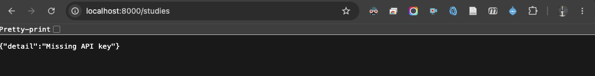

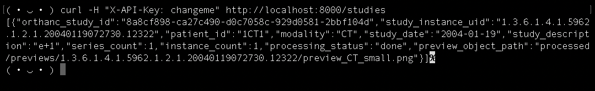

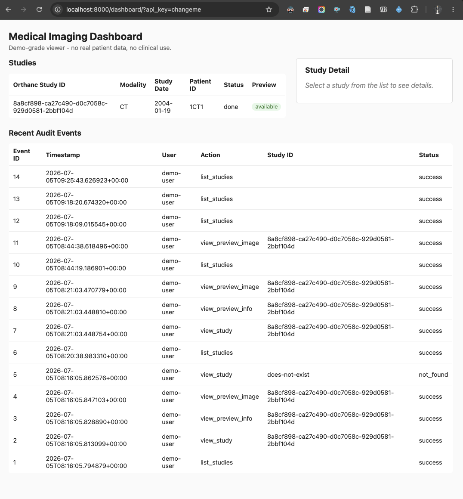

## Step 11 - Backup and Restore

In this step, simple backup and restore scripts were added for the local stack.

Two scripts were added under:

```text
scripts/backup/backup.sh
scripts/backup/restore.sh
```

`backup.sh` writes a timestamped folder under `scripts/backup/output/` (git-ignored), containing:

```text
postgres.sql
minio/
orthanc-storage.tar.gz
```

All three use tools already inside the running containers - no extra images needed. Postgres is dumped with `pg_dump --clean --if-exists` so it drops and recreates its own tables on restore. MinIO objects are copied out with `mc mirror` (MinIO's own client, already bundled in the `minio` container). Orthanc's storage volume is tarred with `tar`, run inside the `orthanc` container itself, then copied to the host with `docker cp`.

`restore.sh` takes a backup folder as its argument, asks for a `y`/`N` confirmation, then restores PostgreSQL and MinIO the same way in reverse. Orthanc's storage is not auto-restored - its DICOM files and internal index have to stay consistent with each other, and restoring them safely means stopping the container first, which felt like more risk than this step needed. `docs/backup-restore.md` documents the manual steps instead.

Commands used:

```bash
./scripts/backup/backup.sh
```

Restore was tested for real, not just read through. After taking a backup, the current state was deliberately damaged: one throwaway row was inserted into `audit_events`, and the CT preview PNG was deleted from MinIO with `mc rm`. Row count went from 15 to 16, and the preview object was confirmed gone. Running `restore.sh` against the backup brought the row count back to 15 (the throwaway row was gone), and the deleted preview object was back in MinIO.

```bash
docker exec postgres psql -U medimaging -d medimaging -c "INSERT INTO audit_events (user_id, action, study_id, status) VALUES ('demo-user', 'simulated_drift_row', 'test-only', 'success');"
docker exec minio mc rm "local/medimaging/processed/previews/1.3.6.1.4.1.5962.1.2.1.20040119072730.12322/preview_CT_small.png"
./scripts/backup/restore.sh scripts/backup/output/20260705-113904
docker exec postgres psql -U medimaging -d medimaging -c "SELECT COUNT(*) FROM audit_events;"
docker exec minio mc ls local/medimaging/processed/previews --recursive
```

Screenshots:

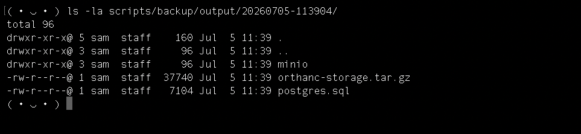

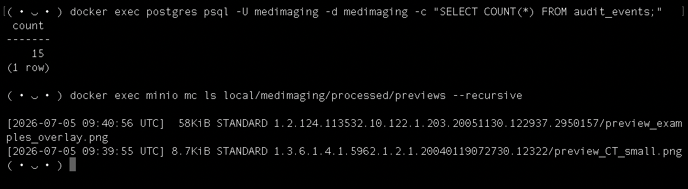

## Step 12 - Failure Handling and Status Tracking

In this step, each stage of the imaging pipeline started reporting whether it actually worked, instead of just succeeding silently or crashing with no record of what happened.

Four new columns were added to the `studies` table:

```text
anonymization_status
preview_status
upload_status
last_error
```

The pipeline has four stages that already existed from earlier steps: metadata extraction, anonymization, preview generation, and MinIO upload. Each one already ran, but none of them wrote down whether they succeeded. Metadata extraction already had its own status column (`processing_status`, from Step 3), so the new columns cover the other three stages. Every status is one of `pending`, `done`, or `failed`. `last_error` holds the plain text of whatever went wrong, so a failure isn't just a blank status - there's a reason next to it.

Each script updates its own column right after it finishes:

```python
def update_pipeline_status(study_uid, column, status, error=None):
    conn = psycopg2.connect(...)
    try:
        with conn:
            with conn.cursor() as cur:
                cur.execute(
                    f"UPDATE studies SET {column} = %s, last_error = %s, updated_at = now() "
                    "WHERE study_instance_uid = %s",
                    (status, error, study_uid),
                )
    finally:
        conn.close()
```

`extract.py` also got a small change: it used to process every study in one block, so one bad study could stop the whole run. Now each study is handled on its own, so a failure on one study just gets recorded and the script moves on to the next one instead of stopping.

The new fields are visible through the API - `GET /studies` and `GET /studies/{id}` both return `anonymization_status`, `preview_status`, `upload_status`, and `last_error` alongside the existing fields. The dashboard's Study Detail panel shows all four stages as small colored labels (green for done, red for failed, yellow for pending), plus the error text when there is one.

To check this for real, a copy of the anonymized CT file was deliberately cut short partway through - keeping the DICOM header (so the file still has a real, valid study ID) but losing part of the actual image data at the end. This is the same kind of damage a real DICOM file could end up with from an interrupted copy or a bad download. Running the preview generator against that cut-short copy failed cleanly instead of crashing:

```bash
./services/preview-generator/.venv/bin/python services/preview-generator/generate_preview.py services/anonymizer/output/anonymized_CT_small_corrupted.dcm
```

The script printed a clear error and stopped, and `preview_status` for that study was set to `failed` with the reason attached - pydicom's own message, saying the file had less image data than its header said it should. In plain terms: the file's header was promising more picture data than the file actually contained, which is exactly the kind of damage a cut-off file produces. That failure showed up immediately through both the API and the dashboard for the real study, which is the whole point of this step. Afterward, the preview generator was run again against the real, uncorrupted file, which set `preview_status` back to `done`.

Screenshots:

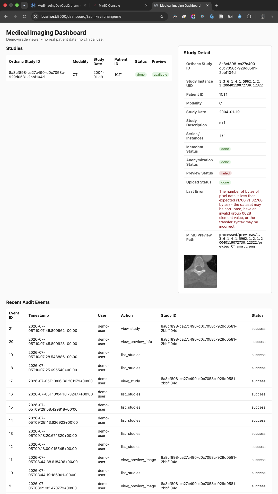

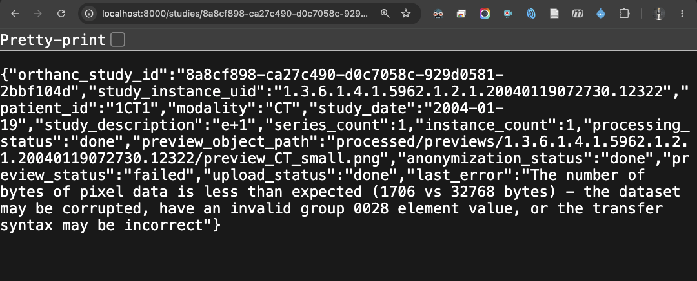

## Step 13 - Structured Logging

In this step, the API and every pipeline script started printing their logs as one JSON object per line, instead of plain sentences.

Plain print statements are fine to read while watching one script run by hand, but they cannot be searched, filtered, or fed into a monitoring tool later. A JSON line with the same fields on every event is worth setting up now, even before any log collection tool is actually in place.

Every service uses the same small helper function, repeated in each script rather than shared, matching how `update_pipeline_status` was already handled in Step 12:

```python
def log_event(action, status="success", study_id=None, error=None, level="INFO", **extra):
    entry = {
        "timestamp": datetime.now(timezone.utc).isoformat(),
        "level": level,
        "service": SERVICE_NAME,
        "action": action,
        "study_id": study_id,
        "status": status,
        "error": error,
    }
    entry.update(extra)
    print(json.dumps(entry), flush=True)
```

Every log line has the same core fields:

```text
timestamp
level
service
action
study_id
status
error
```

Six services now write these logs:

```text
api (services/api/main.py)
metadata-extractor (services/metadata-extractor/extract.py)
anonymizer (services/anonymizer/anonymize.py)
preview-generator (services/preview-generator/generate_preview.py and upload_preview.py)
minio-uploader (services/minio-uploader/upload.py)
backup and restore (scripts/backup/backup.sh and restore.sh)
```

In the API, one middleware function already wrapped every request to check the API key, so it was extended to log an `http_request` event for every request, including its method, path, response status code, and how long it took:

```python
response = await call_next(request)
duration_ms = round((time.monotonic() - started) * 1000, 1)
log_event(
    "http_request",
    status="success" if response.status_code < 400 else "error",
    level="INFO" if response.status_code < 400 else "ERROR",
    method=method, path=path, status_code=response.status_code, duration_ms=duration_ms,
)
```

Docker itself calls `GET /health` automatically every 30 seconds to check that the container is still alive. That is not a real event worth logging forever, so the middleware skips it entirely instead of writing a JSON line for every check:

```python
if request.url.path == "/health":
    return await call_next(request)
```

Study access, preview access, and audit events all already ran through one function, `log_audit_event`, from Step 9. That function now also prints a structured log line every time it writes an audit row, so all three of those are covered by the same one line of code:

```python
log_event(action, status=status, study_id=study_id, user_id=DEMO_USER_ID, ip_address=ip_address)
```

The backup and restore scripts are plain bash, so they use a small shell function instead of Python, printing the same JSON shape by hand with `printf`:

```bash
log_event() {
  local action="$1" status="$2" error="${3:-}"
  local level="INFO"
  [ "$status" = "failed" ] && level="ERROR"
  local timestamp
  timestamp="$(date -u +%Y-%m-%dT%H:%M:%SZ)"
  printf '{"timestamp":"%s","level":"%s","service":"backup","action":"%s","study_id":null,"status":"%s","error":null}\n' \
    "$timestamp" "$level" "$action" "$status"
}
```

Both scripts log a `started` event at the top and a `done` event at the end, and a `trap` catches any command that fails partway through and logs a `failed` event with the command and line number before the script exits.

No log collection tool was added in this step. There is no Loki and no Grafana yet, just readable JSON lines printed to stdout.

To check this for real, the API was exercised by hand with a mix of requests: a request with no API key (401), a request with the wrong key (403), a request with the correct key (200), a lookup of a real study, and a lookup of a study ID that does not exist (404). Every one of those showed up as a structured line in `docker compose logs api`, with the right status and, for the 404, the `not_found` status against the real study lookup action. Each pipeline script was also run by hand once against the real demo study, and each one printed a clean `started` line followed by a `success` line.

Failure logging was checked the same way Step 12 checked its own failure handling: a copy of the anonymized CT file was cut short partway through its image data, keeping the header (and the real study ID) intact but breaking the actual pixel data. Running the preview generator against that cut-short copy printed a structured line with `"status": "failed"`, `"level": "ERROR"`, and pydicom's real error message describing exactly what was wrong, and the same failure was reflected in the `studies` table's `preview_status` column, same as in Step 12. Afterward, the preview generator was run again against the real, uncorrupted file, which put everything back to `done`.

The exact commands used:

```bash
source .env
STUDY_ID="8a8cf898-ca27c490-d0c7058c-929d0581-2bbf104d"

curl -s -o /dev/null http://localhost:8000/studies
curl -s -o /dev/null -H "X-API-Key: wrong" http://localhost:8000/studies
curl -s -o /dev/null -H "X-API-Key: $API_SECRET_KEY" http://localhost:8000/studies
curl -s -o /dev/null -H "X-API-Key: $API_SECRET_KEY" "http://localhost:8000/studies/$STUDY_ID"
curl -s -o /dev/null -H "X-API-Key: $API_SECRET_KEY" http://localhost:8000/studies/does-not-exist

docker compose logs api --tail 20
```

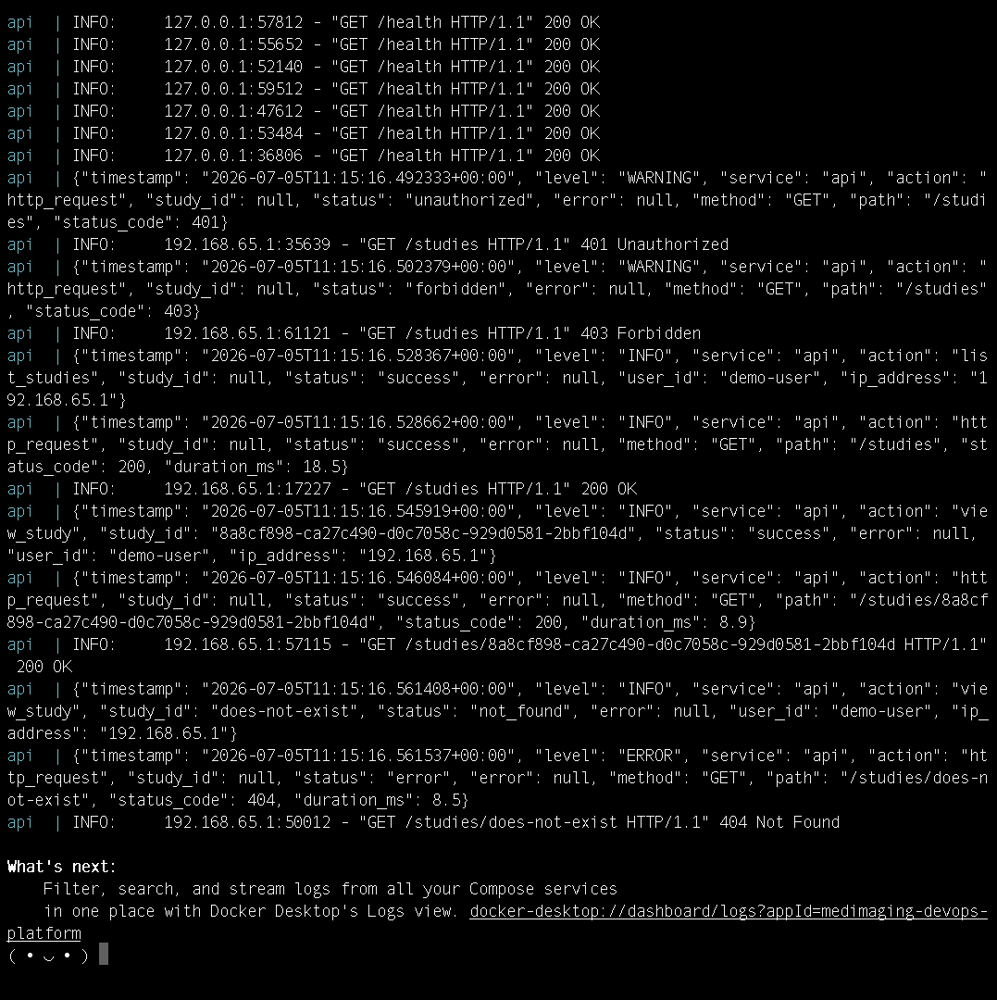

The same five checks work directly in a browser too, instead of a terminal, since the API has accepted the key as an `?api_key=` query parameter since Step 10 (that was originally added for the dashboard's preview image, which can't send a custom header). Typing each URL straight into the address bar gives the same responses a curl request would get, just rendered by the browser instead of printed to a terminal:

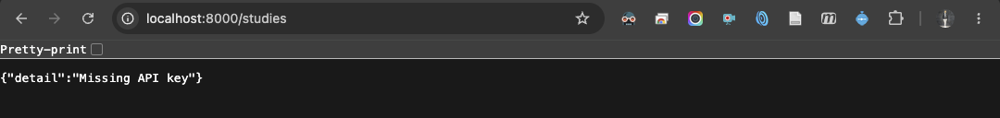

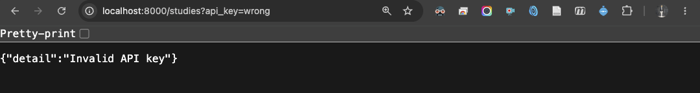

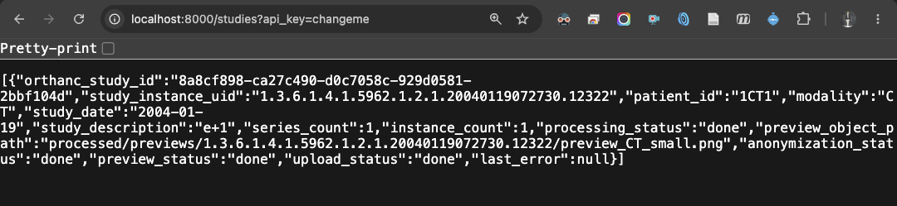

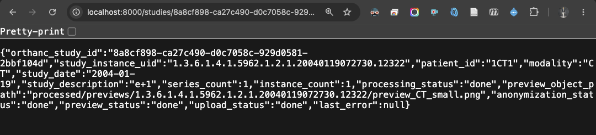

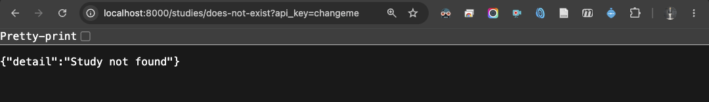

One pipeline script was also run directly in the terminal, without Docker Compose, since it still runs manually on the host:

```bash
./services/metadata-extractor/.venv/bin/python services/metadata-extractor/extract.py
```

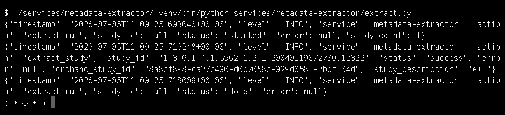

## Step 14 - Monitoring with Prometheus and Grafana

In this step, Prometheus and Grafana were added to the stack so the API's health and activity can be watched on a dashboard instead of only being visible through logs.

Structured logs from Step 13 are good for looking at one event after it happened, but they don't show trends over time, like whether request counts are climbing or a metric is slowly getting worse. Prometheus and Grafana are the standard pair of tools for that: Prometheus collects numbers on a timer and stores them, and Grafana draws them as a dashboard.

Two new containers were added to `docker-compose.yml`:

```yaml
prometheus:
  image: prom/prometheus:latest
  ports:
    - "${PROMETHEUS_PORT:-9090}:9090"
  volumes:
    - ./infra/monitoring/prometheus/prometheus.yml:/etc/prometheus/prometheus.yml:ro
    - prometheus-data:/prometheus

grafana:
  image: grafana/grafana:latest
  ports:
    - "${GRAFANA_PORT:-3000}:3000"
  environment:
    GF_SECURITY_ADMIN_USER: ${GRAFANA_ADMIN_USER:-admin}
    GF_SECURITY_ADMIN_PASSWORD: ${GRAFANA_ADMIN_PASSWORD:-changeme}
  volumes:
    - ./infra/monitoring/grafana/provisioning:/etc/grafana/provisioning:ro
    - ./infra/monitoring/grafana/dashboards:/var/lib/grafana/dashboards:ro
    - grafana-data:/var/lib/grafana
```

The API needed something for Prometheus to actually scrape, so a new public endpoint was added using the `prometheus-client` Python library:

```python
@app.get("/metrics")
def metrics():
    conn = get_connection()
    try:
        with conn.cursor() as cur:
            cur.execute("SELECT COUNT(*) FROM studies")
            STUDIES_TOTAL.set(cur.fetchone()[0])
            cur.execute(
                "SELECT COUNT(*) FROM studies WHERE "
                "processing_status = 'failed' OR anonymization_status = 'failed' "
                "OR preview_status = 'failed' OR upload_status = 'failed'"
            )
            STUDIES_FAILED_TOTAL.set(cur.fetchone()[0])
    finally:
        conn.close()
    return Response(generate_latest(), media_type=CONTENT_TYPE_LATEST)
```

`/metrics` doesn't require the API key. Prometheus has no way to send one, so it was added to the same public path list as `/health`, and it isn't counted as API traffic itself, same as `/health` already wasn't.

The API now tracks these metrics:

```text
http_requests_total            - counter, labeled by method, path, and status code
http_request_duration_seconds  - histogram of how long each request took
studies_total                  - gauge, current row count in the studies table
studies_failed_total           - gauge, studies with at least one failed pipeline stage
process_start_time_seconds     - when the process started, built into the prometheus-client library itself
```

`studies_total` and `studies_failed_total` are set fresh from Postgres every time `/metrics` is scraped, so they can never go stale between scrapes. The request counter and duration are recorded in the same middleware that already logged every request in Step 13, right next to that existing `log_event` call:

```python
REQUEST_COUNT.labels(method=method, path=path, status_code=str(response.status_code)).inc()
REQUEST_DURATION.labels(method=method, path=path).observe(duration_seconds)
```

Prometheus's own config, at `infra/monitoring/prometheus/prometheus.yml`, tells it to scrape itself and the API every 15 seconds:

```yaml
scrape_configs:
  - job_name: prometheus
    static_configs:
      - targets: ["localhost:9090"]

  - job_name: api
    metrics_path: /metrics
    static_configs:
      - targets: ["api:8000"]
```

Grafana needed no manual setup at all. Both its Prometheus connection and its dashboard are provisioned automatically from files under `infra/monitoring/grafana/` the moment the container starts:

```text
infra/monitoring/grafana/provisioning/datasources/prometheus.yml   - the Prometheus connection
infra/monitoring/grafana/provisioning/dashboards/dashboards.yml    - tells Grafana where to find dashboard files
infra/monitoring/grafana/dashboards/api-overview.json              - the dashboard itself
```

The datasource file pins a fixed `uid: prometheus`, and every panel in the dashboard JSON points at that same uid, so Grafana always wires the dashboard to the right datasource on a fresh start rather than relying on a name match.

The dashboard, "Imaging API Overview," has six panels: API Up, Service Health (the `up` value for every scrape target, not just the API), Failed Processing Count, Total API Requests, Average Request Duration, and Studies Total. Container-level metrics (CPU, memory per container) were left out of this step on purpose - a tool like cAdvisor could add those later, but it brings its own compatibility quirks on Docker Desktop for Mac, and Docker Compose's existing per-container healthchecks (from Step 1) already cover the basic "is this container alive" question without adding another moving part.

To check this for real, the whole stack was brought up together first, and each new piece was checked in turn.

All six containers were confirmed running at once in Docker Desktop, the fourth and fifth from the left being the two new ones added in this step:

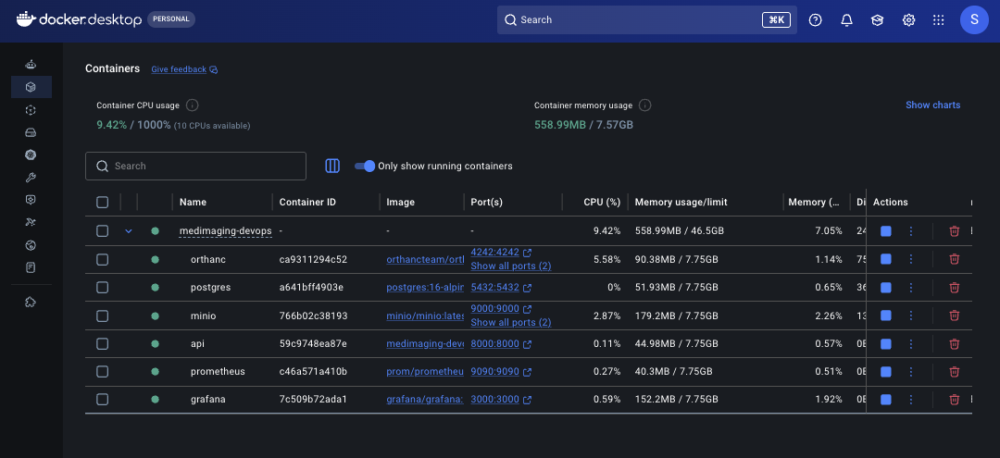

The API's `/metrics` endpoint was queried directly, to confirm it returns real Prometheus-formatted numbers instead of an error:

```bash
curl http://localhost:8000/metrics
```

Prometheus's own Targets page (**Status → Targets** in its web UI) was opened next, to confirm it can actually reach both the API and itself on a schedule, not just that the config file looks right:

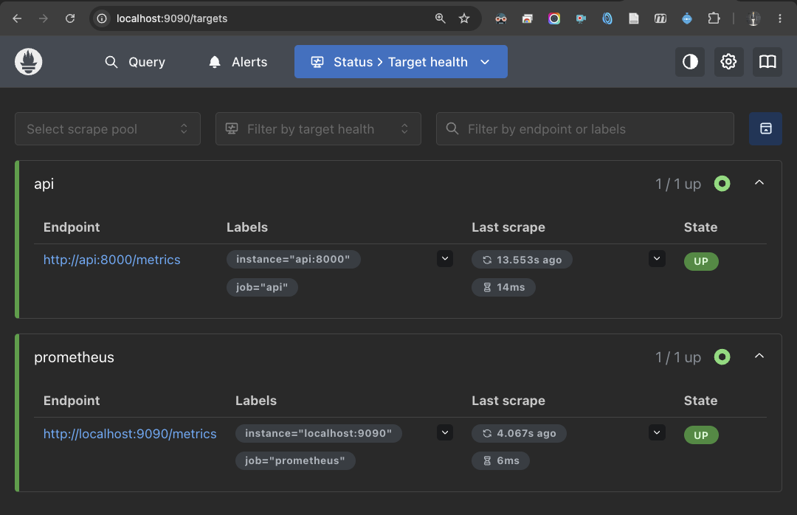

Grafana was opened for the first time at `localhost:3000`, which shows its login page. Logging in uses the demo admin credentials from `.env` (`GRAFANA_ADMIN_USER` / `GRAFANA_ADMIN_PASSWORD`), not a personal account:

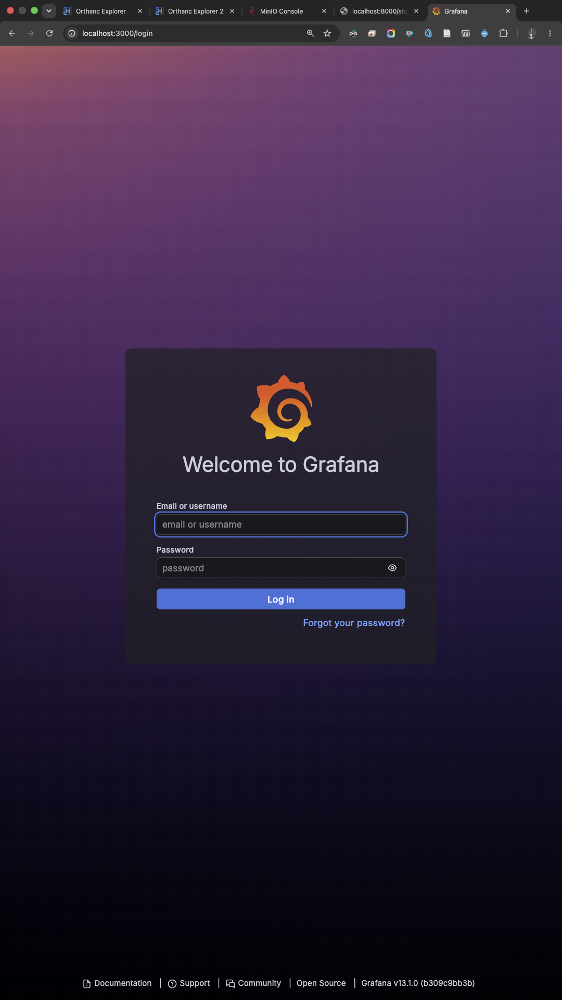

After logging in, the provisioned "Imaging API Overview" dashboard was opened directly, with all six panels already showing live numbers instead of "No data":

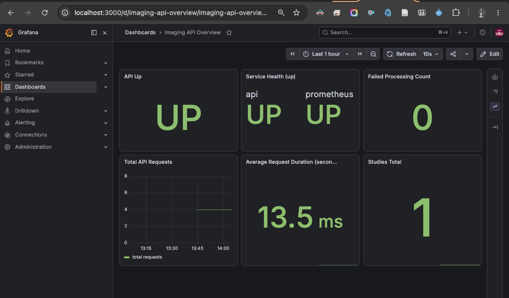
